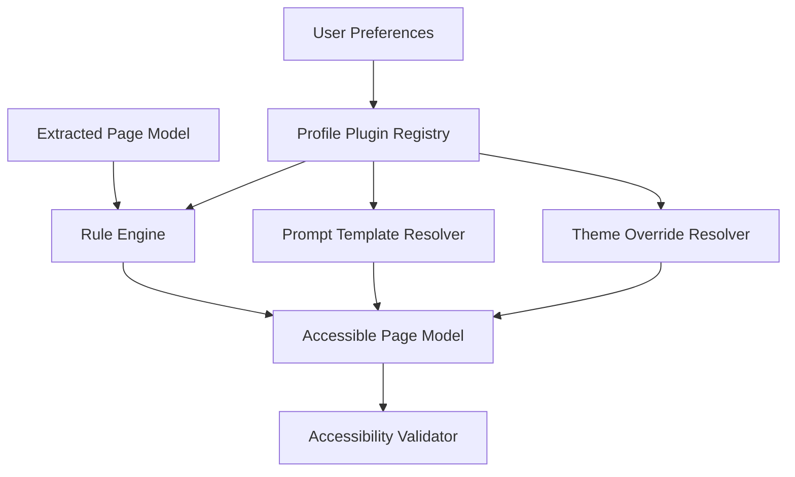

# Saralo Accessibility Engine Design

## 1. Purpose

The Accessibility Engine transforms extracted page content into a personalized, cognitively accessible, visually comfortable, and voice-ready experience. It uses a plugin system so profiles can be independently configured, tested, versioned, and improved.

Required accessibility profiles:

- AI Adaptive.
- ADHD.
- Dyslexia.
- Binocular Vision.
- Color Vision.
- Presbyopia.
- Visual Comfort.
- Senior.

Each profile is a plugin.

## 2. Engine Architecture



## 3. Registration System

Every profile plugin registers through a manifest.

Manifest fields:

- `plugin_key`
- `version`
- `profile_key`
- `display_name`
- `description`
- `supported_conditions`
- `rules`
- `prompt_templates`
- `theme_overrides`
- `client_hints`
- `default_settings`
- `conflicts`
- `compatible_plugins`

Example manifest shape:

```json
{
  "plugin_key": "saralo.accessibility.senior",
  "version": "1.0.0",
  "profile_key": "senior",
  "display_name": "Senior",
  "description": "Larger text, clearer steps, reduced clutter, and voice-friendly reading.",
  "default_settings": {},
  "rules": {},
  "prompt_templates": {},
  "theme_overrides": {}
}
```

Registration lifecycle:

1. Load plugin manifest.
2. Validate schema and version.
3. Validate rule compatibility.
4. Validate theme tokens.
5. Validate prompt templates.
6. Register profile in `accessibility_profiles`.
7. Register plugin mapping in `accessibility_profile_plugins`.
8. Run profile test fixtures.
9. Enable plugin.

## 4. Shared Accessibility Config

Global config:

```json
{
  "min_touch_target_px": 44,
  "default_line_length_chars": 70,
  "max_paragraph_sentences": 3,
  "allow_motion": false,
  "default_reading_level": "plain",
  "preserve_original_text": true,
  "show_ai_labels": true,
  "voice_ready_output": true
}
```

Shared rules:

- Use semantic headings.
- Keep reading order explicit.
- Break dense content into sections.
- Preserve critical dates, amounts, names, and eligibility terms.
- Provide source links.
- Use plain, respectful language.
- Provide keyboard and screen reader hints.
- Avoid motion by default.
- Never hide warnings or required actions.

## 5. Profile: AI Adaptive

### Intent

AI Adaptive automatically chooses accessibility transformations based on page complexity, user behavior, preferences, and explicit user feedback.

### Config

```json
{
  "profile_key": "ai_adaptive",
  "adaptation_mode": "conservative",
  "observe_user_feedback": true,
  "auto_switch_profiles": false,
  "suggest_profile_changes": true
}
```

### Rules

- Detect long paragraphs and apply chunking.
- Detect dense navigation and collapse secondary links.
- Detect forms and add step-by-step guidance.
- Detect low readability and request simplification.
- Detect security warnings and keep them prominent.
- Suggest but do not silently enable major profile changes.

### Prompt Templates

- "Simplify this content using the user's active preferences. Preserve meaning, dates, amounts, and required actions."
- "Identify which accessibility profile would reduce cognitive load and explain why in one sentence."

### Theme Overrides

```json
{
  "font_size": "user_preference",
  "spacing": "comfortable",
  "contrast": "user_preference",
  "motion": "reduced"
}
```

## 6. Profile: ADHD

### Intent

Reduce distraction, support focus, and turn tasks into clear next steps.

### Config

```json
{
  "focus_mode": true,
  "section_at_a_time": true,
  "progress_indicators": true,
  "max_visible_actions": 3
}
```

### Rules

- Show one primary section at a time.
- Highlight one recommended next action.
- Convert workflows into checklists.
- Collapse secondary content.
- Use short headings.
- Add progress indicators.
- Avoid decorative motion.

### Prompt Templates

- "Rewrite this as short, direct steps. Keep only the next useful action visible."
- "Create a checklist that helps the user complete this page without losing their place."

### Theme Overrides

```json
{
  "layout_density": "focused",
  "section_spacing": "large",
  "animations": "none",
  "primary_action_emphasis": "strong"
}
```

## 7. Profile: Dyslexia

### Intent

Improve readability through spacing, predictable structure, and careful text transformation.

### Config

```json
{
  "dyslexia_spacing": true,
  "line_height": 1.7,
  "paragraph_spacing": "large",
  "max_line_length_chars": 60
}
```

### Rules

- Increase line height and paragraph spacing.
- Avoid dense all-caps labels.
- Use short paragraphs.
- Provide glossary support.
- Keep headings predictable.
- Avoid justified text.
- Support read-aloud.

### Prompt Templates

- "Rewrite this in short sentences with simple words while preserving exact meaning."
- "Identify difficult words and explain them in a short glossary."

### Theme Overrides

```json
{
  "font_family": "readable_sans",
  "line_height": 1.7,
  "letter_spacing": "normal",
  "text_align": "left",
  "paragraph_spacing": "large"
}
```

## 8. Profile: Binocular Vision

### Intent

Reduce eye strain for users with convergence, tracking, or binocular vision discomfort.

### Config

```json
{
  "max_line_length_chars": 55,
  "reduce_horizontal_scanning": true,
  "stable_layout": true,
  "large_spacing": true
}
```

### Rules

- Use narrow readable content columns.
- Avoid multi-column text.
- Increase spacing between interactive controls.
- Avoid sticky overlays that obscure text.
- Keep layout stable during reading.
- Provide section-by-section navigation.

### Prompt Templates

- "Split this content into shorter sections with clear headings and no multi-column assumptions."

### Theme Overrides

```json
{
  "content_width": "narrow",
  "line_height": 1.65,
  "section_spacing": "large",
  "layout_shift_prevention": true
}
```

## 9. Profile: Color Vision

### Intent

Ensure information does not rely on color alone and remains understandable across color vision differences.

### Config

```json
{
  "avoid_color_only_meaning": true,
  "pattern_or_icon_reinforcement": true,
  "contrast_minimum": "wcag_aa"
}
```

### Rules

- Add text labels to status colors.
- Use icons and labels for warnings.
- Ensure contrast compliance.
- Avoid red/green-only comparisons.
- Provide table labels and legends.

### Prompt Templates

- "Explain any visual status or color-coded meaning using text labels."

### Theme Overrides

```json
{
  "status_labels": true,
  "warning_style": "icon_and_text",
  "contrast": "high_safe",
  "link_decoration": "underline"
}
```

## 10. Profile: Presbyopia

### Intent

Improve readability for age-related near-vision difficulty.

### Config

```json
{
  "default_text_size": "extra_large",
  "large_controls": true,
  "high_legibility": true
}
```

### Rules

- Use extra-large default text.
- Increase touch target size.
- Increase spacing around controls.
- Avoid small secondary labels.
- Keep contrast strong but not glaring.
- Support read-aloud for long text.

### Prompt Templates

- "Create a short summary first, then provide larger step-by-step sections."

### Theme Overrides

```json
{
  "font_size": "extra_large",
  "control_size": "large",
  "line_height": 1.6,
  "contrast": "comfortable_high"
}
```

## 11. Profile: Visual Comfort

### Intent

Reduce visual fatigue and sensory overload.

### Config

```json
{
  "low_glare": true,
  "reduced_motion": true,
  "soft_contrast": true,
  "hide_visual_noise": true
}
```

### Rules

- Use calm contrast.
- Remove animations.
- Hide decorative clutter.
- Avoid bright saturated backgrounds.
- Preserve strong focus states.
- Provide generous spacing.

### Prompt Templates

- "Summarize this content calmly and remove non-essential distractions from the reading flow."

### Theme Overrides

```json
{
  "contrast": "low_glare",
  "background": "soft_neutral",
  "motion": "none",
  "focus_ring": "visible"
}
```

## 12. Profile: Senior

### Intent

Support elderly users with plain language, large controls, reassurance, and guided tasks.

### Config

```json
{
  "text_size": "extra_large",
  "show_reassurance": true,
  "step_by_step": true,
  "voice_enabled": true,
  "confirm_sensitive_actions": true
}
```

### Rules

- Use plain language.
- Explain what the page is asking.
- Show important warnings clearly.
- Convert forms into guided steps.
- Provide review before sensitive actions.
- Emphasize read-aloud controls.
- Avoid jargon.

### Prompt Templates

- "Explain this page as if helping an older adult complete it independently. Be respectful, calm, and clear."
- "List what the user needs before starting this form."

### Theme Overrides

```json
{
  "font_size": "extra_large",
  "control_size": "large",
  "contrast": "comfortable_high",
  "section_spacing": "large",
  "voice_controls": "prominent"
}
```

## 13. Rule Engine

Rule categories:

- Content rules.
- Layout rules.
- Cognitive rules.
- Visual rules.
- Form rules.
- Voice-readiness rules.
- Security-warning rules.

Rule evaluation order:

1. Security rules.
2. Required content preservation.
3. User-selected profile rules.
4. AI Adaptive suggestions.
5. Theme overrides.
6. Client rendering hints.
7. Validation.

Security warnings and required form information always outrank comfort transformations.

## 14. Prompt Template Integration

Accessibility profiles can modify AI output style but cannot weaken AI safety rules.

Profile prompts may control:

- Sentence length.
- Reading level.
- Checklist style.
- Explanation style.
- Section chunking.
- Glossary behavior.
- Voice-friendly phrasing.

Profile prompts may not:

- Remove source grounding.
- Hide uncertainty.
- Hide warnings.
- Change critical obligations.
- Override security blocks.

## 15. Theme Override System

Theme overrides are design tokens, not arbitrary CSS.

Supported token groups:

- Typography.
- Spacing.
- Contrast.
- Color role.
- Motion.
- Focus state.
- Touch target.
- Layout density.
- Section width.
- Voice control prominence.

Clients map tokens to platform-native UI.

## 16. Accessibility Validation

Each transformed page must be validated for:

- Heading order.
- Reading order.
- Minimum contrast.
- Keyboard navigation metadata.
- Screen reader labels.
- Touch target hints.
- Reduced motion compliance.
- Link labels.
- Warning visibility.
- Original text availability.

## 17. Events

- `AccessibilityProfileSelected`
- `AccessibilityRulesResolved`
- `AccessibilityTransformStarted`
- `AccessibilityTransformCompleted`
- `AccessibilityValidationFailed`
- `AccessibilityProfileSuggested`

## 18. Hackathon MVP Scope

MVP profiles:

- AI Adaptive.
- ADHD.
- Dyslexia.
- Senior.
- Visual Comfort.

MVP transformations:

- Text size.
- Contrast.
- Focus mode.
- Plain-language sections.
- Checklist generation.
- Voice-ready reading order.

Deferred:

- Full binocular vision calibration.
- Advanced color simulation.
- Profile auto-switching.
- Caregiver-managed profile templates.

## 19. Freeze Decisions

- Every accessibility profile is a plugin.
- Accessibility output is a structured accessible page model.
- Profile rules cannot override security warnings.
- Prompt templates are versioned.
- Theme overrides use design tokens.
- AI Adaptive suggests major changes instead of silently applying them.
- Senior, ADHD, Dyslexia, Visual Comfort, Color Vision, Binocular Vision, Presbyopia, and AI Adaptive are the required profile set.

## 20. Review Hardening

- CTO: profile plugins create an extensible accessibility platform instead of one-off settings.
- Senior Backend Engineer: manifests, rule ordering, and validation make profiles testable.
- AI Engineer: prompt templates are profile-specific but bound by global grounding rules.
- Accessibility Engineer: each profile affects content, structure, prompts, and theme tokens.
- Security Engineer: security warnings always outrank comfort transformations.
- UX Designer: tokenized themes keep clients consistent without hardcoding presentation.
- Product Manager: required profiles cover the core audiences named in the PRD.
- Hackathon Judge: profile switching creates a visible, understandable demo moment.
