# Saralo Enterprise Software Architecture

## 1. Architecture Vision

Saralo is a headless, API-first cognitive accessibility platform. The backend owns webpage ingestion, security analysis, content extraction, AI transformation, accessibility transformation, voice processing, user preferences, auditability, and public API contracts. Client applications consume these capabilities through stable APIs.

The architecture must support:

- Web app MVP.
- Future Chrome extension.
- Future desktop app.
- Future mobile app.
- Public API for partners and enterprise customers.
- Plugin-based transformation, AI, security, voice, and extraction modules.
- Event-driven background processing for expensive and asynchronous workflows.
- Clean Architecture boundaries so product features remain testable, replaceable, and independent of infrastructure choices.

## 2. Core Architecture Principles

### Headless Backend

Saralo should not couple product capabilities to a single frontend. The backend exposes all core workflows through APIs and events. The web application, browser extension, mobile app, desktop app, and enterprise integrations should all use the same backend contracts.

### Feature-First Architecture

Code should be organized around product capabilities, not technical layers alone. Each major feature owns its domain model, application services, interfaces, adapters, events, policies, tests, and documentation.

Primary feature modules:

- Identity and access.
- User preferences.
- URL ingestion.
- Webpage fetching.
- Security scanning.
- Content extraction.
- Accessibility transformation.
- AI assistant.
- Translation.
- Voice.
- Sessions and history.
- Public API.
- Plugin registry.
- Observability and audit.

### Clean Architecture

Each feature follows Clean Architecture:

- Domain layer contains business rules and entities.
- Application layer contains use cases and service orchestration.
- Ports define interfaces needed by the application layer.
- Adapters implement ports for databases, queues, AI providers, speech providers, browser rendering, external APIs, and storage.
- Interface layer exposes HTTP, WebSocket, event consumers, CLI jobs, and worker entry points.

The dependency rule is strict: outer layers depend on inner layers; inner layers do not depend on frameworks or infrastructure.

### Event Driven

Saralo should use events for long-running, expensive, or multi-stage workflows. URL analysis, AI summarization, translation, voice generation, security scans, and analytics should be modeled as pipeline stages connected by events.

### Plugin Architecture

Saralo should allow capabilities to be added or replaced without changing core workflows. Plugins should be supported for:

- Content extractors.
- Security scanners.
- Accessibility transformers.
- AI providers.
- Prompt strategies.
- Translation providers.
- Text-to-speech providers.
- Speech-to-text providers.
- Enterprise policy packs.
- Domain-specific simplifiers such as healthcare, government, education, and finance.

### Adapter Pattern

All external systems should be accessed through adapters behind stable ports. This keeps Saralo portable across vendors and environments.

Examples:

- AI model adapter.
- HTML fetch adapter.
- Browser rendering adapter.
- Malware reputation adapter.
- Text-to-speech adapter.
- Speech-to-text adapter.
- Object storage adapter.
- Database repository adapter.
- Queue adapter.
- Analytics adapter.

### Repository Pattern

Persistence should be accessed through repository interfaces owned by feature modules. Domain and application services should not know whether data is stored in PostgreSQL, Redis, object storage, search indexes, or a future enterprise database.

### Service Layer

Application services coordinate use cases. They validate input, load policies and preferences, call domain services, invoke ports, publish events, and return DTOs. They should not contain framework-specific HTTP or database code.

### Configuration First

Runtime behavior should be controlled through typed configuration:

- Feature flags.
- Provider selection.
- Security policy.
- AI model configuration.
- Rate limits.
- Fetch limits.
- Retention rules.
- Plugin registration.
- Accessibility presets.
- Voice settings.
- Public API quotas.

Configuration should be environment-aware, validated on startup, and auditable.

## 3. System Architecture

Saralo has five major runtime surfaces:

- Client surfaces: web app, future Chrome extension, future desktop app, future mobile app, and partner API clients.
- API edge: API gateway, authentication, rate limiting, request validation, and API versioning.
- Headless application backend: feature modules and application services.
- Event and worker platform: asynchronous pipelines for fetching, scanning, extraction, AI, accessibility, voice, and observability.
- Infrastructure services: databases, object storage, cache, queue, search, model providers, speech providers, and monitoring.

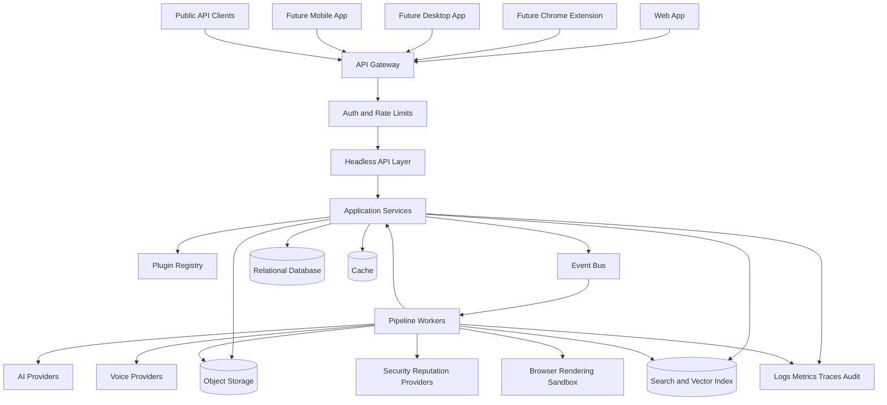

## 4. Runtime Components

### Client Applications

Clients should remain thin. They are responsible for presentation, accessibility UI controls, local interaction state, and user consent prompts. They should not own canonical transformation logic.

Client types:

- Web app: primary MVP experience.
- Chrome extension: future page capture, live simplification, and in-page assistive overlay.
- Desktop app: future accessibility shell for older users and support workers.
- Mobile app: future simplified browsing, voice-first assistance, and saved summaries.
- Public API clients: enterprise integrations, partner portals, and accessibility testing tools.

### API Gateway

Responsibilities:

- TLS termination.
- API version routing.
- Authentication enforcement.
- Rate limiting.
- Request size limits.
- Abuse prevention.
- Public API key validation.
- Tenant routing for enterprise customers.

### Headless API Layer

Responsibilities:

- REST or GraphQL endpoints for synchronous requests.
- WebSocket or Server-Sent Events for streaming progress and assistant responses.
- Public API contracts.
- Request validation.
- Response DTO mapping.
- Idempotency key handling.
- Error normalization.

### Application Services

Responsibilities:

- Execute use cases.
- Enforce product policies.
- Load user preferences.
- Coordinate repositories and adapters.
- Publish domain and integration events.
- Return stable response models.

### Domain Services

Responsibilities:

- Represent core business rules.
- Evaluate security policy outcomes.
- Decide transformation eligibility.
- Select accessibility presets.
- Enforce consent and retention rules.
- Score extraction confidence.
- Classify sensitive forms and actions.

### Plugin Registry

Responsibilities:

- Register built-in and third-party plugins.
- Validate plugin manifests.
- Resolve plugins by capability, tenant, user preference, domain, content type, and feature flag.
- Enforce plugin permissions.
- Provide plugin health status.
- Support versioned plugin execution.

### Event Bus

Responsibilities:

- Publish immutable workflow events.
- Decouple pipeline stages.
- Support retries and dead-letter queues.
- Preserve event ordering where required by session.
- Support consumer groups for scalable workers.

### Workers

Responsibilities:

- Run expensive tasks outside request-response flows.
- Execute fetch, scan, extract, AI, translation, accessibility, and voice stages.
- Emit progress events.
- Persist intermediate artifacts.
- Handle retries and failure recovery.

### Data Stores

Recommended logical stores:

- Relational database for users, sessions, preferences, jobs, policies, plugins, API keys, audit metadata, and workflow state.
- Object storage for sanitized page snapshots, extracted content artifacts, generated audio, and large transformation outputs.
- Cache for short-lived sessions, rate limits, progress state, and provider response caching.
- Search index for saved summaries, enterprise accessibility analysis, and future document discovery.
- Vector index for retrieval over extracted page sections when supporting grounded Q&A at scale.

## 5. Backend Pipeline

The backend pipeline begins when a user submits a URL and ends when Saralo produces an accessible page session with optional AI, translation, and voice outputs.

### Pipeline Stages

1. Request intake.
2. URL validation and normalization.
3. User and tenant policy loading.
4. Security preflight.
5. Fetch planning.
6. Secure webpage fetch.
7. Response validation.
8. HTML sanitization and isolation.
9. Content extraction.
10. Page structure analysis.
11. Security deep scan.
12. Accessibility analysis.
13. AI summarization and simplification.
14. Accessibility transformation.
15. Voice preparation.
16. Session persistence.
17. Progress streaming.
18. User interaction through chat, voice, translation, and guided forms.

```mermaid
flowchart LR
    URL[URL Submitted]
    Validate[Validate and Normalize URL]
    Policy[Load User Tenant Policy]
    Preflight[Security Preflight]
    Fetch[Secure Fetch]
    Response[Validate Response]
    Sanitize[Sanitize and Isolate HTML]
    Extract[Extract Content]
    Analyze[Analyze Structure]
    DeepScan[Security Deep Scan]
    A11y[Accessibility Analysis]
    AI[AI Summary and Simplification]
    Transform[Accessible Transformation]
    Persist[Persist Session Artifacts]
    Stream[Stream Progress and Results]

    URL --> Validate
    Validate --> Policy
    Policy --> Preflight
    Preflight --> Fetch
    Fetch --> Response
    Response --> Sanitize
    Sanitize --> Extract
    Extract --> Analyze
    Analyze --> DeepScan
    Analyze --> A11y
    DeepScan --> AI
    A11y --> AI
    AI --> Transform
    Transform --> Persist
    Persist --> Stream
```

### Backend Workflow Events

Recommended event names:

- `PageSessionRequested`
- `UrlValidated`
- `SecurityPreflightCompleted`
- `FetchRequested`
- `PageFetched`
- `FetchRejected`
- `PageSanitized`
- `ContentExtracted`
- `PageStructureAnalyzed`
- `SecurityScanCompleted`
- `AccessibilityAnalysisCompleted`
- `AiSummaryRequested`
- `AiSummaryCompleted`
- `AccessibilityTransformCompleted`
- `VoiceGenerationRequested`
- `VoiceAssetGenerated`
- `PageSessionReady`
- `PageSessionFailed`

### Request-Response vs Async Split

Synchronous:

- URL validation.
- Policy checks.
- Job creation.
- Initial response with session ID.
- Lightweight cached results when available.

Asynchronous:

- Fetching.
- Deep scanning.
- Extraction.
- AI transformation.
- Voice generation.
- Translation.
- Analytics.

Streaming:

- Pipeline progress.
- Partial summaries.
- Chat responses.
- Voice generation status.

## 6. AI Pipeline

The AI pipeline must be grounded, auditable, and resistant to prompt injection from fetched webpages.

### AI Pipeline Stages

1. Input selection from sanitized extracted content.
2. Prompt injection detection and content risk labeling.
3. Section chunking.
4. Retrieval index creation for page session.
5. Task classification: summarize, simplify, explain, translate, guide, answer.
6. Prompt assembly using trusted system prompts and untrusted page content separation.
7. Model provider selection.
8. AI generation.
9. Grounding verification.
10. Safety review.
11. Readability scoring.
12. Citation or source-section linking.
13. Response persistence and streaming.

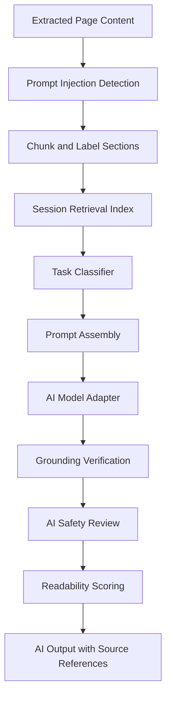

### AI Capabilities

- Page summary.
- Section summary.
- Plain-language rewrite.
- Glossary generation.
- Key action extraction.
- Sensitive action explanation.
- Form guidance.
- Page-specific Q&A.
- Translation.
- Reading-level adaptation.
- Domain-specific simplification through plugins.

### AI Boundaries

- AI must not execute page instructions.
- AI must not treat webpage content as system instructions.
- AI must not invent facts not supported by extracted content.
- AI must label transformed content as AI-assisted.
- AI must preserve access to original text.
- AI must use caution for medical, legal, financial, safety, or government content.

### AI Provider Abstraction

The AI model port should support:

- Chat completion.
- Structured output.
- Embeddings.
- Moderation or safety classification.
- Token counting.
- Streaming.
- Batch processing.
- Provider failover.
- Cost tracking.

Adapters can implement this port for multiple model providers without changing application services.

## 7. Accessibility Pipeline

The accessibility pipeline converts extracted and AI-enhanced content into a personalized accessible experience.

### Accessibility Pipeline Stages

1. Load user preferences.
2. Detect page complexity.
3. Detect content structure.
4. Detect forms, tables, warnings, and key actions.
5. Select transformation strategy.
6. Apply cognitive accessibility rules.
7. Apply visual accessibility rules.
8. Apply reading and language preferences.
9. Create simplified page model.
10. Validate output for accessibility constraints.
11. Return render-ready accessible document.

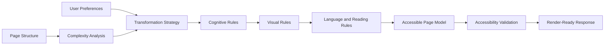

### Accessibility Transformations

- Chunk long content into short sections.
- Generate plain-language headings.
- Highlight key actions.
- Convert dense paragraphs into short blocks.
- Create step-by-step checklists for workflows.
- Provide form field explanations.
- Add warnings before sensitive actions.
- Offer glossary explanations.
- Support focus mode.
- Support large text.
- Support high contrast.
- Support reduced motion.
- Support dyslexia-friendly spacing.
- Support voice-readable content.
- Preserve original source links.

### Accessible Page Model

The backend should return a structured page model rather than pre-rendered HTML as the primary public contract. This allows each client to render natively while preserving consistent semantics.

Recommended logical sections:

- Page metadata.
- Source attribution.
- Risk status.
- Summary.
- Key actions.
- Content sections.
- Forms.
- Tables.
- Links.
- Warnings.
- Glossary.
- AI annotations.
- Voice assets.
- User preference hints.

## 8. Security Pipeline

Security is a first-class product pipeline because Saralo fetches arbitrary URLs and processes untrusted content.

### Security Pipeline Stages

1. URL scheme validation.
2. Domain and IP normalization.
3. DNS resolution and private network blocking.
4. Redirect policy enforcement.
5. Threat intelligence lookup.
6. Request sandboxing.
7. Response size and content type validation.
8. HTML sanitization.
9. Script, iframe, and active content removal.
10. Link and form risk classification.
11. Sensitive data detection.
12. Prompt injection detection.
13. Policy decision: allow, warn, restrict, or block.
14. Audit logging.

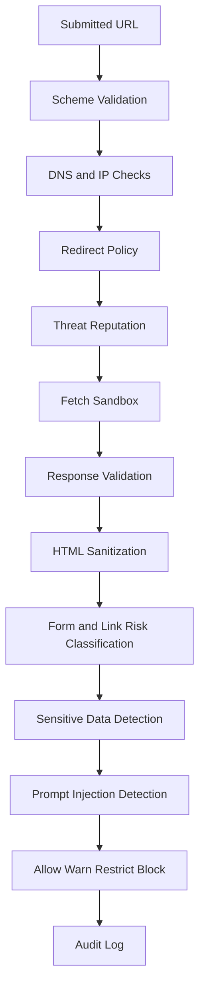

### Security Controls

- Block non-HTTP schemes.
- Block localhost and private IP ranges.
- Re-resolve DNS after redirects.
- Enforce maximum redirect count.
- Enforce request timeout.
- Enforce response byte limits.
- Enforce content type allowlist.
- Strip scripts, event handlers, iframes, embeds, and active content from display artifacts.
- Isolate fetched content from application shell.
- Apply Content Security Policy.
- Store sanitized artifacts separately from raw artifacts.
- Avoid storing sensitive form inputs.
- Rate limit URL submissions, chat requests, translation requests, and voice requests.
- Detect prompt injection strings in page content.
- Maintain audit logs for security decisions.

### Security Policy Outcomes

- `allow`: content is safe enough to transform normally.
- `warn`: content can be shown with a visible user warning.
- `restrict`: content can be summarized but links, forms, or certain actions are disabled.
- `block`: content is not fetched or displayed.

## 9. Voice Pipeline

Voice features should be optional, accessible, and available through the same headless backend.

### Text-to-Speech Pipeline

1. User requests read-aloud for summary, section, assistant response, or translated content.
2. Backend checks consent, quota, and content risk.
3. Text is normalized for speech.
4. Voice preference is loaded.
5. TTS provider adapter generates audio.
6. Audio asset is stored with retention policy.
7. Client receives playback URL or streaming response.
8. Captions and text equivalent remain available.

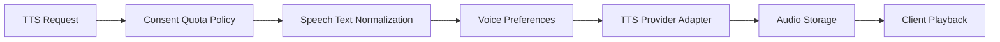

### Speech-to-Text Pipeline

1. User asks a question by voice.
2. Client records audio with explicit user action.
3. Backend validates audio format and size.
4. STT provider adapter transcribes audio.
5. Transcription confidence is evaluated.
6. User can confirm or edit transcription.
7. Confirmed text is sent to the AI assistant pipeline.

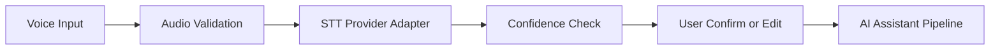

### Voice Design Rules

- Never make critical flows voice-only.
- Always provide text equivalents.
- Provide visible playback controls.
- Support slow speech.
- Support repeat.
- Do not auto-record.
- Make recording state obvious.
- Apply retention controls to audio.

## 10. Public API Architecture

The public API should expose Saralo capabilities to enterprise customers and partners while protecting user privacy and platform security.

### API Product Areas

- Page sessions API.
- URL analysis API.
- Accessibility transformation API.
- AI summary API.
- Page Q&A API.
- Translation API.
- Voice API.
- User preferences API.
- Plugin capability discovery API.
- Audit and usage API.

### API Principles

- Version every public endpoint.
- Support idempotency keys for job creation.
- Return stable status objects for async workflows.
- Use webhooks for completion notifications.
- Provide streaming for long AI responses.
- Provide clear error codes.
- Enforce quotas per tenant and API key.
- Separate user-scoped tokens from machine-to-machine API keys.
- Avoid exposing raw fetched HTML by default.

### Public API Flow

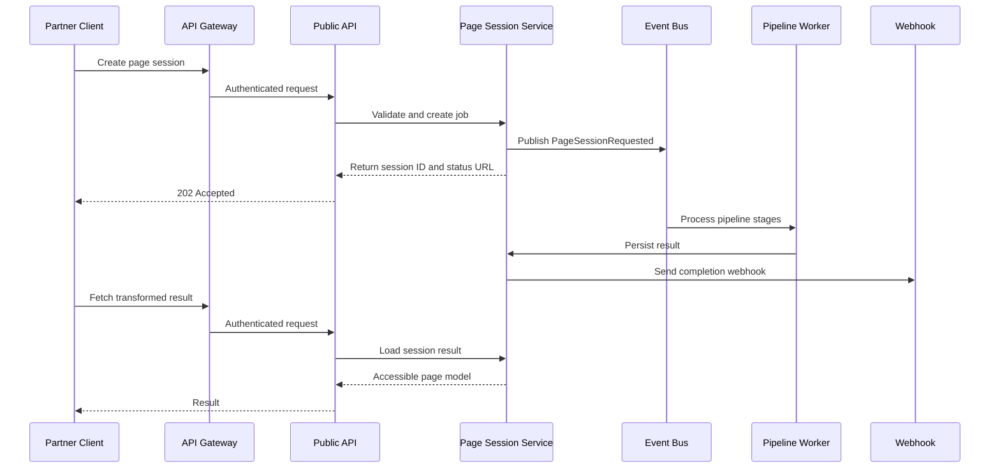

## 11. Future Chrome Extension Support

The Chrome extension should use the public or first-party API contracts rather than separate backend logic.

### Extension Capabilities

- Send current page URL to Saralo.
- Send selected page text for simplification.
- Request page summary.
- Request plain-language explanation of selected text.
- Display a simplified side panel.
- Offer read-aloud controls.
- Warn about risky pages.
- Support authenticated user preferences.

### Extension-Specific Architecture

- Browser extension captures URL, visible text, or DOM snapshot with user permission.
- Extension sends a page session request to backend.
- Backend applies the same security, extraction, AI, and accessibility pipelines.
- Extension renders accessible page model in side panel or overlay.
- Extension never bypasses backend policy checks.

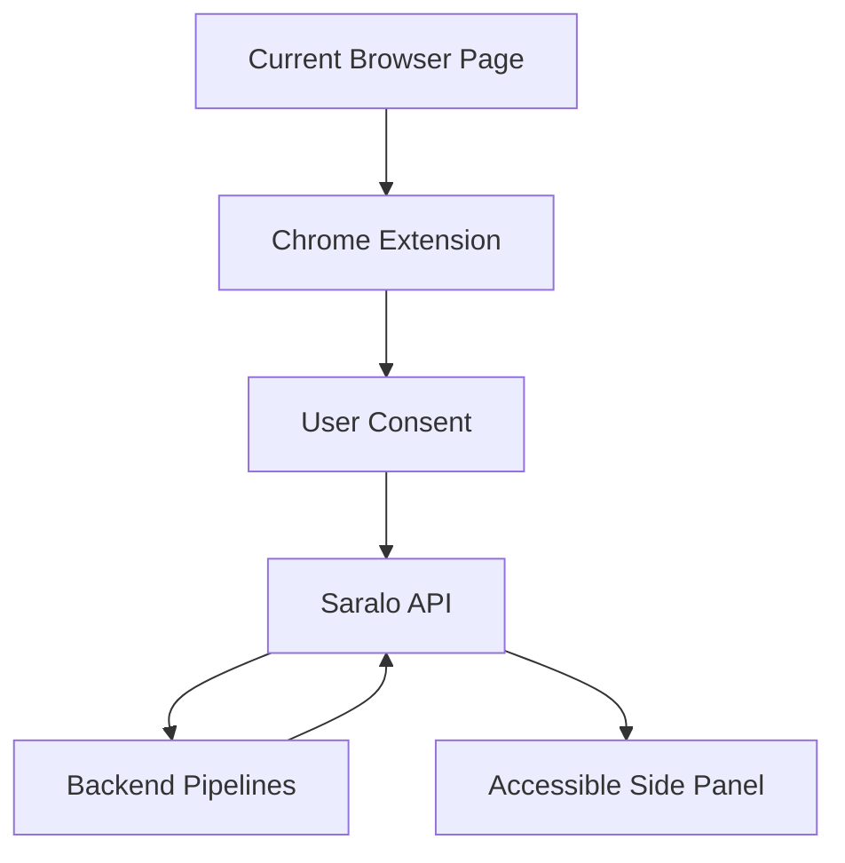

## 12. Future Desktop App Support

The desktop app should be a native shell over Saralo APIs. It can provide older users and caregivers a calmer dedicated environment with larger controls and OS-level accessibility integration.

Potential capabilities:

- Simplified browser shell.
- Persistent voice controls.
- Caregiver-managed settings.
- Offline saved summaries.
- OS text-to-speech integration through a voice adapter.
- Secure local session storage.

Architecture requirements:

- Same headless API contracts.
- Optional local cache with strict privacy settings.
- Device authorization flow.
- Native accessibility settings sync where possible.
- No duplication of transformation logic.

## 13. Future Mobile App Support

The mobile app should use the same accessible page model with native rendering.

Potential capabilities:

- Paste or share URL into Saralo.
- Voice-first page summaries.
- Large touch targets.
- Saved pages and summaries.
- Caregiver sharing.
- Push notifications for async processing completion.

Architecture requirements:

- Same backend page session APIs.
- Mobile-specific DTO view hints where needed.
- Push notification adapter.
- Offline cache with user consent.
- Privacy-first handling of shared URLs.

## 14. Plugin Architecture

Plugins make Saralo extensible without changing core application services.

### Plugin Types

- `extractor`: extracts content from specific page types or domains.
- `security-scanner`: detects threats, phishing, sensitive forms, or prompt injection.
- `accessibility-transformer`: applies cognitive or visual transformations.
- `ai-provider`: connects to model providers.
- `prompt-pack`: provides task-specific prompt templates and guardrails.
- `translator`: connects to translation services.
- `tts-provider`: generates audio.
- `stt-provider`: transcribes voice input.
- `policy-pack`: adds enterprise, regional, or domain-specific rules.
- `renderer-hint-provider`: suggests client rendering behavior.

### Plugin Lifecycle

1. Discover plugin manifest.
2. Validate permissions and compatibility.
3. Register provided capabilities.
4. Health check plugin.
5. Resolve plugin during pipeline execution.
6. Execute plugin through stable port.
7. Capture telemetry and errors.
8. Disable or roll back unhealthy plugin versions.

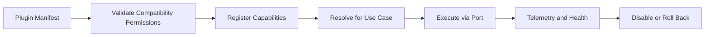

### Plugin Safety Rules

- Plugins must declare permissions.
- Plugins cannot access secrets unless explicitly granted.
- Plugins cannot bypass security policy.
- Plugins cannot directly write core records without repositories.
- Plugins must be versioned.
- Plugins must emit structured errors.
- Plugins must be tenant-aware when used in enterprise contexts.

## 15. Adapter Pattern

Adapters isolate infrastructure and vendors from core logic.

### Required Ports and Adapters

| Port | Example Adapters |
| --- | --- |
| `WebFetcherPort` | Basic HTTP fetcher, browser renderer, enterprise proxy fetcher |
| `HtmlSanitizerPort` | DOM sanitizer, policy-based sanitizer |
| `ContentExtractorPort` | Readability extractor, semantic extractor, domain plugin extractor |
| `SecurityScannerPort` | Internal scanner, threat intel provider, enterprise scanner |
| `AiModelPort` | Model provider A, model provider B, local model |
| `EmbeddingPort` | Cloud embeddings, local embeddings |
| `TranslationPort` | AI translation, dedicated translation provider |
| `TextToSpeechPort` | Cloud TTS, OS TTS for desktop, enterprise TTS |
| `SpeechToTextPort` | Cloud STT, browser STT, enterprise STT |
| `ObjectStoragePort` | S3-compatible storage, Azure Blob, local development storage |
| `QueuePort` | Managed queue, Kafka, Redis streams |
| `NotificationPort` | Webhooks, email, push notifications |
| `AnalyticsPort` | Product analytics, internal metrics, privacy-preserving analytics |

## 16. Repository Pattern

Repositories are owned by feature modules. Application services depend on repository interfaces, not database implementations.

### Core Repositories

- `UserRepository`
- `PreferenceRepository`
- `PageSessionRepository`
- `FetchArtifactRepository`
- `ExtractedContentRepository`
- `TransformationRepository`
- `ConversationRepository`
- `VoiceAssetRepository`
- `PluginRepository`
- `PolicyRepository`
- `ApiKeyRepository`
- `AuditLogRepository`
- `UsageRepository`

### Persistence Rules

- Store raw fetched content only when necessary and under strict retention.
- Store sanitized artifacts separately from raw artifacts.
- Store generated summaries and transformations with source references.
- Store user preferences independently from page sessions.
- Store audit events append-only.
- Store sensitive data minimally and encrypted.

## 17. Service Layer

Application services should map directly to product use cases.

### Core Services

- `PageSessionService`: creates and manages page simplification sessions.
- `UrlValidationService`: validates and normalizes submitted URLs.
- `SecurityAssessmentService`: coordinates security policies and scanners.
- `FetchService`: plans and performs secure fetches through ports.
- `ExtractionService`: extracts page content and structure.
- `AccessibilityService`: creates accessible page models.
- `AiAssistantService`: summarizes, simplifies, explains, and answers questions.
- `TranslationService`: translates summaries and transformed content.
- `VoiceService`: handles TTS and STT workflows.
- `PreferenceService`: manages accessibility and voice preferences.
- `PluginRegistryService`: resolves and governs plugins.
- `PublicApiService`: applies API product policies and versioned contracts.
- `AuditService`: records security, privacy, and policy decisions.
- `UsageService`: tracks quotas and metering.

## 18. Folder Structure

The folder structure below is a proposed enterprise layout. It is feature-first, with shared platform modules kept small and stable.

```text
saralo/
  apps/
    web/
    api/
    worker/
    scheduler/
    public-api/
    chrome-extension/
    desktop/
    mobile/

  features/
    identity/
      domain/
      application/
      ports/
      adapters/
      interface/
      events/
      tests/

    preferences/
      domain/
      application/
      ports/
      adapters/
      interface/
      events/
      tests/

    page-session/
      domain/
      application/
      ports/
      adapters/
      interface/
      events/
      tests/

    url-ingestion/
      domain/
      application/
      ports/
      adapters/
      interface/
      events/
      tests/

    security/
      domain/
      application/
      ports/
      adapters/
      interface/
      policies/
      events/
      tests/

    fetching/
      domain/
      application/
      ports/
      adapters/
      interface/
      events/
      tests/

    extraction/
      domain/
      application/
      ports/
      adapters/
      interface/
      plugins/
      events/
      tests/

    accessibility/
      domain/
      application/
      ports/
      adapters/
      interface/
      rules/
      presets/
      events/
      tests/

    ai-assistant/
      domain/
      application/
      ports/
      adapters/
      interface/
      prompts/
      evaluators/
      events/
      tests/

    translation/
      domain/
      application/
      ports/
      adapters/
      interface/
      events/
      tests/

    voice/
      domain/
      application/
      ports/
      adapters/
      interface/
      events/
      tests/

    public-api/
      domain/
      application/
      ports/
      adapters/
      interface/
      contracts/
      events/
      tests/

    plugins/
      domain/
      application/
      ports/
      adapters/
      interface/
      manifests/
      registry/
      tests/

    observability/
      domain/
      application/
      ports/
      adapters/
      interface/
      events/
      tests/

  platform/
    config/
    event-bus/
    database/
    cache/
    object-storage/
    search/
    queue/
    logging/
    metrics/
    tracing/
    errors/
    auth/
    rate-limits/
    encryption/
    feature-flags/

  packages/
    contracts/
    accessible-page-model/
    api-client/
    extension-sdk/
    plugin-sdk/
    test-fixtures/

  docs/
    PRD.md
    Architecture.md
    Database.md
    API.md
    AI.md
    Security.md
    Accessibility.md
    Voice.md

  config/
    default/
    development/
    staging/
    production/
    enterprise/

  tests/
    integration/
    contract/
    e2e/
    security/
    accessibility/
    ai-evaluation/
```

## 19. Dependency Graph

### Clean Architecture Dependency Rule

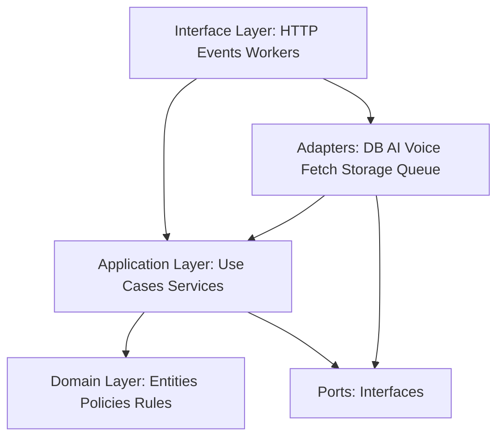

### Feature Dependency Graph

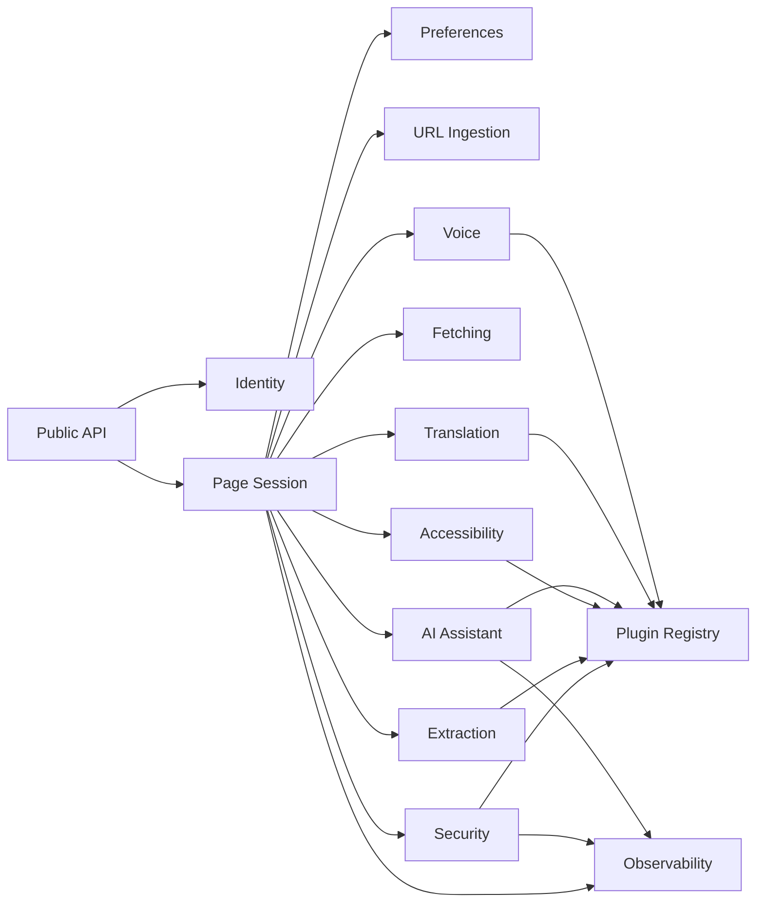

### Event Dependency Graph

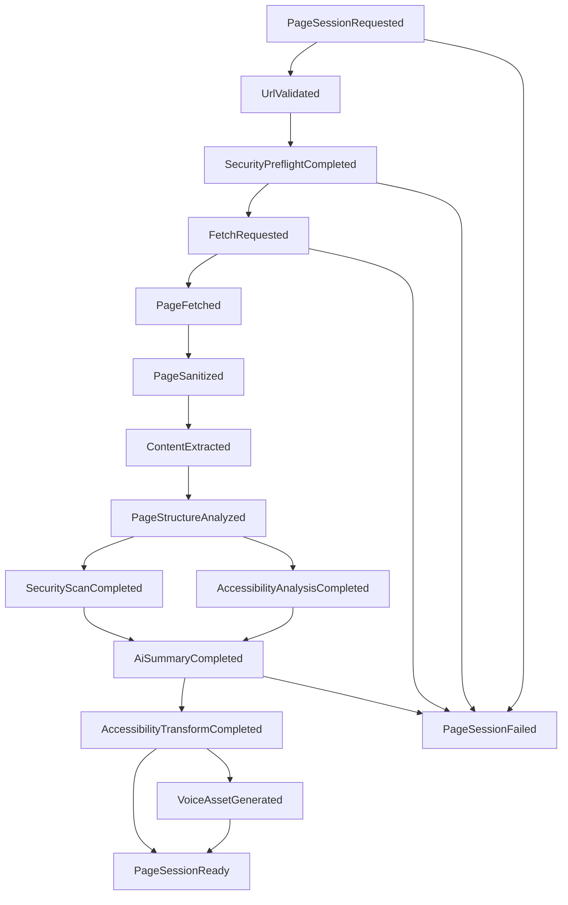

## 20. Configuration-First Design

Saralo should be deployable across local development, hackathon MVP, cloud production, and enterprise environments by changing configuration, not core code.

### Configuration Domains

- App identity and environment.
- API server settings.
- Worker concurrency.
- Queue topics.
- Database connections.
- Object storage buckets.
- Cache settings.
- AI provider and model routing.
- Embedding provider.
- Speech provider.
- Translation provider.
- Security policy.
- Fetch limits.
- Retention policy.
- Feature flags.
- Plugin registry.
- Tenant overrides.
- Rate limits and quotas.
- Observability exporters.

### Configuration Rules

- Validate configuration at startup.
- Fail fast when required configuration is missing.
- Keep secrets out of versioned config.
- Support tenant-level overrides.
- Support feature flags for experimental pipelines.
- Record active configuration version in audit metadata.
- Keep default values conservative for security and privacy.

## 21. Data Architecture

### Primary Entities

- User.
- Tenant.
- User preference profile.
- API key.
- Page session.
- Submitted URL.
- Fetch artifact.
- Sanitized artifact.
- Extracted page.
- Page section.
- Security assessment.
- Accessibility assessment.
- AI transformation.
- Conversation.
- Voice asset.
- Plugin.
- Policy.
- Audit event.
- Usage record.

### Data Retention Defaults

- Raw fetched content: disabled or shortest practical retention by default.
- Sanitized content: retained per user or tenant setting.
- AI summaries: retained only if session history is enabled.
- Voice audio: short retention unless saved by user.
- Audit logs: retained according to security and compliance policy.
- Analytics: aggregate and privacy-preserving by default.

## 22. Observability Architecture

Saralo needs observability across user experience, AI quality, accessibility outcomes, and security posture.

### Telemetry Types

- Logs for operational events.
- Metrics for latency, error rate, throughput, queue depth, provider cost, and quota usage.
- Traces for end-to-end request and pipeline flow.
- Audit events for security, privacy, policy, and administrative actions.
- AI evaluation records for factuality, grounding, safety, and readability.
- Accessibility quality records for contrast, structure, keyboard compatibility, and transformation confidence.

### Required Dashboards

- Page session success rate.
- Fetch rejection reasons.
- Extraction quality.
- AI latency and cost.
- Voice generation latency.
- Security warnings and blocks.
- Public API usage.
- Worker queue health.
- Plugin health.
- Accessibility transformation quality.

## 23. Design Decisions

### Decision 1: Headless API-First Backend

Saralo will expose core product capabilities through APIs rather than embedding them in the web frontend.

Rationale:

- Enables future Chrome extension, desktop app, mobile app, and public API.
- Keeps client applications thin.
- Allows shared security, AI, and accessibility logic.

Tradeoff:

- Requires stronger API contracts and versioning earlier.

### Decision 2: Feature-First Clean Architecture

Saralo will organize backend code by features and apply Clean Architecture inside each feature.

Rationale:

- Aligns engineering boundaries with product capabilities.
- Keeps features independently testable.
- Reduces coupling between AI, security, accessibility, and voice.

Tradeoff:

- Requires discipline to avoid duplicated shared utilities.

### Decision 3: Event-Driven Pipeline

Saralo will use events for the page processing workflow.

Rationale:

- URL processing has variable latency.
- AI, voice, translation, and security scans can be expensive.
- Progress can be streamed to users.
- Workers can scale independently.

Tradeoff:

- Adds operational complexity around queues, retries, and idempotency.

### Decision 4: Structured Accessible Page Model

Saralo will return a structured accessible page model instead of relying only on generated HTML.

Rationale:

- Supports web, extension, mobile, and desktop clients.
- Preserves semantic accessibility.
- Allows native rendering per platform.
- Enables public API use cases.

Tradeoff:

- Requires careful contract design and client renderers.

### Decision 5: Plugin-Based Extensibility

Saralo will use a plugin system for extractors, security scanners, AI providers, accessibility transformers, voice providers, and policy packs.

Rationale:

- New domains and providers can be added without rewriting core workflows.
- Enterprise customers can use custom policy packs.
- Provider lock-in is reduced.

Tradeoff:

- Plugin permissions, testing, and lifecycle management must be robust.

### Decision 6: Adapter and Repository Patterns

Saralo will isolate external systems and persistence behind ports, adapters, and repositories.

Rationale:

- Supports provider replacement.
- Improves testability.
- Keeps domain and application logic independent of infrastructure.

Tradeoff:

- Introduces more interfaces and initial architecture overhead.

### Decision 7: Security as a Pipeline

Saralo will treat security as a multi-stage product pipeline, not a single validation function.

Rationale:

- Arbitrary URL fetching is high risk.
- Fetched content can attack rendering, users, and AI prompts.
- Risk can change across redirects, content, forms, and user actions.

Tradeoff:

- More stages can increase latency, requiring careful progress UX and caching.

### Decision 8: Configuration-First Runtime

Saralo will use typed, validated configuration for providers, policies, limits, plugins, and features.

Rationale:

- Supports hackathon, production, and enterprise deployments.
- Makes security posture auditable.
- Enables controlled experiments.

Tradeoff:

- Configuration management must be treated as a product surface with validation and documentation.

### Decision 9: AI Grounding and Prompt Isolation

Saralo will separate trusted system instructions from untrusted page content and verify AI outputs against source content.

Rationale:

- Webpage content can contain prompt injection.
- Users need trustworthy summaries and explanations.
- High-stakes domains require caution.

Tradeoff:

- May increase AI latency and implementation complexity.

### Decision 10: No Automatic Form Submission in Core MVP

Saralo will guide users through forms but will not automatically submit forms in the MVP architecture.

Rationale:

- Form submission can trigger financial, legal, medical, or account actions.
- User trust and consent are central to the product.
- Security and liability review should happen before automation.

Tradeoff:

- Some workflows will remain guidance-only until later phases.

## 24. Recommended MVP Architecture Slice

For the hackathon MVP, implement the smallest architecture slice that still respects the future platform:

- Web app client.
- Headless API service.
- Worker service.
- Page session feature.
- URL validation feature.
- Security preflight feature.
- Fetching feature with strict SSRF protection.
- Extraction feature with basic HTML extraction.
- AI assistant feature for summary and Q&A.
- Accessibility feature for simplified page model.
- Voice feature for text-to-speech.
- Preferences feature for text size, contrast, language, and simplification level.
- Basic plugin registry with built-in plugins only.
- Relational database or simple persistence layer.
- Object storage abstraction, even if local in development.
- Event bus abstraction, even if implemented with a simple queue in MVP.

This gives Saralo a credible enterprise foundation without overbuilding the first version.

## 25. Architecture Summary

Saralo should be built as a headless, feature-first, clean, event-driven platform. The web app is only the first client. The real product is the backend accessibility intelligence layer: secure URL ingestion, content extraction, AI-powered comprehension, accessibility transformation, voice, personalization, and public APIs.

This architecture gives Saralo room to grow from hackathon MVP into a platform that supports browser extensions, desktop apps, mobile apps, enterprise pilots, and public API integrations without rewriting the core product.

## 26. Architecture Freeze

The architecture is frozen around the following documents:

- `PRD.md`: product scope, users, MVP boundaries, and success criteria.
- `Architecture.md`: system architecture, pipelines, module boundaries, dependency graph, and design decisions.
- `Database.md`: Supabase PostgreSQL schema, RLS, storage, audit, analytics, and security tables.
- `API.md`: REST v1 contracts, request and response models, authentication, rate limits, errors, and pagination.
- `AI.md`: AI Gateway, Prompt Registry, Memory System, Conversation Engine, Context Manager, and AI capability modules.
- `Accessibility.md`: profile plugin system, rules, prompt templates, and theme overrides.
- `Security.md`: URL validation, reputation, scam and phishing detection, trust score, safe navigation, and security history.
- `Voice.md`: STT, TTS, commands, reading controls, voice sessions, voice preferences, and provider adapters.

### Frozen Implementation Boundaries

- Supabase Auth is the identity authority.
- Supabase PostgreSQL is the MVP system of record.
- REST v1 is the public API contract.
- Page sessions are the central workflow aggregate.
- The accessible page model is the canonical transformed output.
- Security runs before fetch display, AI, voice, and public API result exposure.
- AI uses prompt isolation and source grounding.
- Accessibility profiles are plugins.
- Voice is optional, consent-based, and text-equivalent.
- Workers process long-running pipeline stages asynchronously.
- Provider integrations must use adapters.
- Persistence must use repositories.
- Product behavior must be configuration-first.

### Review Findings Resolved

- CTO concern: avoided frontend-owned intelligence by keeping the backend headless.
- Backend concern: introduced explicit repositories, service layer, event workflow, and adapters.
- AI concern: added prompt isolation, grounding, safety evaluation, and prompt registry.
- Accessibility concern: made profiles plugin-based and tied them to rules, prompts, and theme tokens.
- Security concern: made arbitrary URL handling a first-class pipeline with trust scoring.
- UX concern: preserved a structured accessible page model for consistent rendering across clients.
- Product concern: kept MVP focused on URL-to-simplified-page, summary, Q&A, TTS, and security warnings.
- Hackathon concern: supports a clear, demo-friendly path without blocking future enterprise architecture.
