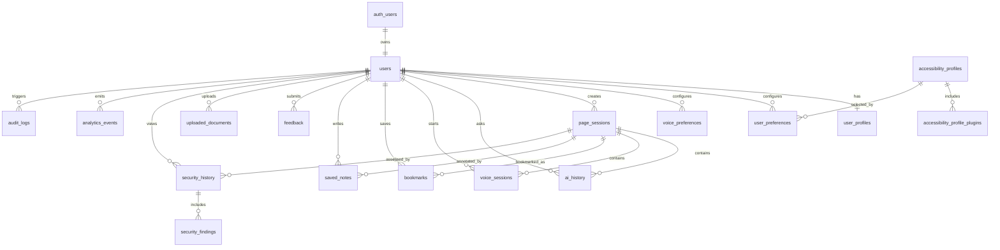

# Saralo Database Design

## 1. Purpose

Saralo uses Supabase PostgreSQL as the system of record for users, accessibility preferences, page sessions, AI history, voice sessions, saved content, security history, analytics, audit trails, uploaded documents, API access, and plugin metadata.

This document freezes the database design for the MVP architecture while leaving room for enterprise tenancy, Chrome extension support, mobile clients, desktop clients, and public API usage.

## 2. Supabase Model

Saralo relies on Supabase for:

- Authentication through `auth.users`.
- PostgreSQL data storage in the `public` schema.
- Row Level Security for user-owned and tenant-owned data.
- Storage buckets for uploaded documents, generated voice assets, sanitized page artifacts, and accessibility exports.
- Edge functions or backend services using the service role for trusted pipeline work.

The application must never modify `auth.users` directly except through Supabase-supported auth flows. Saralo-owned user metadata lives in `public.users`, `public.user_profiles`, `public.user_preferences`, and related tables.

## 3. Entity Groups

### Identity and Profile

- `users`
- `user_profiles`
- `accessibility_profiles`
- `accessibility_profile_plugins`
- `user_preferences`
- `voice_preferences`

### Product Activity

- `page_sessions`
- `ai_history`
- `voice_sessions`
- `bookmarks`
- `saved_notes`
- `feedback`
- `uploaded_documents`

### Security

- `security_history`
- `security_findings`
- `domain_reputation_cache`
- `blocked_url_patterns`

### Observability and Governance

- `analytics_events`
- `audit_logs`
- `api_keys`
- `rate_limit_events`
- `plugin_registry`

## 4. Relationships



## 5. Table Design

### `users`

Public application identity record linked to Supabase Auth.

| Column | Type | Constraints |
| --- | --- | --- |
| `id` | `uuid` | Primary key, references `auth.users(id)` |
| `email` | `citext` | Unique, nullable for provider accounts |
| `role` | `text` | Default `user`, check in `user`, `caregiver`, `admin`, `enterprise_admin` |
| `status` | `text` | Default `active`, check in `active`, `disabled`, `deleted` |
| `tenant_id` | `uuid` | Nullable for future enterprise tenancy |
| `created_at` | `timestamptz` | Default `now()` |
| `updated_at` | `timestamptz` | Default `now()` |
| `deleted_at` | `timestamptz` | Nullable |

### `user_profiles`

Human-facing profile information.

| Column | Type | Constraints |
| --- | --- | --- |
| `id` | `uuid` | Primary key |
| `user_id` | `uuid` | Unique, references `users(id)` |
| `display_name` | `text` | Nullable |
| `preferred_language` | `text` | Default `en` |
| `timezone` | `text` | Default `UTC` |
| `caregiver_mode_enabled` | `boolean` | Default `false` |
| `onboarding_completed_at` | `timestamptz` | Nullable |
| `created_at` | `timestamptz` | Default `now()` |
| `updated_at` | `timestamptz` | Default `now()` |

### `accessibility_profiles`

Catalog of built-in and custom accessibility profiles.

| Column | Type | Constraints |
| --- | --- | --- |
| `id` | `uuid` | Primary key |
| `key` | `text` | Unique, examples: `ai_adaptive`, `adhd`, `dyslexia`, `senior` |
| `name` | `text` | Required |
| `description` | `text` | Required |
| `profile_type` | `text` | Check in `built_in`, `tenant`, `user` |
| `rules` | `jsonb` | Default `{}` |
| `theme_overrides` | `jsonb` | Default `{}` |
| `prompt_templates` | `jsonb` | Default `{}` |
| `is_active` | `boolean` | Default `true` |
| `created_at` | `timestamptz` | Default `now()` |
| `updated_at` | `timestamptz` | Default `now()` |

### `accessibility_profile_plugins`

Maps accessibility profiles to plugin capabilities.

| Column | Type | Constraints |
| --- | --- | --- |
| `id` | `uuid` | Primary key |
| `accessibility_profile_id` | `uuid` | References `accessibility_profiles(id)` |
| `plugin_key` | `text` | Required |
| `plugin_version` | `text` | Required |
| `enabled` | `boolean` | Default `true` |
| `config` | `jsonb` | Default `{}` |
| `created_at` | `timestamptz` | Default `now()` |

### `user_preferences`

Accessibility and product preferences.

| Column | Type | Constraints |
| --- | --- | --- |
| `id` | `uuid` | Primary key |
| `user_id` | `uuid` | References `users(id)` |
| `accessibility_profile_id` | `uuid` | References `accessibility_profiles(id)` |
| `text_size` | `text` | Default `large`, check in `medium`, `large`, `extra_large` |
| `contrast_mode` | `text` | Default `standard`, check in `standard`, `high`, `low_glare`, `dark`, `light` |
| `simplification_level` | `text` | Default `balanced`, check in `light`, `balanced`, `strong` |
| `reading_level` | `text` | Default `plain`, check in `original`, `plain`, `simple`, `step_by_step` |
| `focus_mode` | `boolean` | Default `false` |
| `reduced_motion` | `boolean` | Default `true` |
| `dyslexia_spacing` | `boolean` | Default `false` |
| `language` | `text` | Default `en` |
| `history_enabled` | `boolean` | Default `false` |
| `settings` | `jsonb` | Default `{}` |
| `created_at` | `timestamptz` | Default `now()` |
| `updated_at` | `timestamptz` | Default `now()` |

### `voice_preferences`

Voice-specific preferences.

| Column | Type | Constraints |
| --- | --- | --- |
| `id` | `uuid` | Primary key |
| `user_id` | `uuid` | Unique, references `users(id)` |
| `tts_enabled` | `boolean` | Default `true` |
| `stt_enabled` | `boolean` | Default `false` |
| `voice_provider` | `text` | Nullable |
| `voice_id` | `text` | Nullable |
| `speech_rate` | `numeric(3,2)` | Default `0.90`, between `0.50` and `2.00` |
| `pitch` | `numeric(3,2)` | Default `1.00`, between `0.50` and `2.00` |
| `language` | `text` | Default `en` |
| `auto_play` | `boolean` | Default `false` |
| `captions_enabled` | `boolean` | Default `true` |
| `created_at` | `timestamptz` | Default `now()` |
| `updated_at` | `timestamptz` | Default `now()` |

### `page_sessions`

Canonical session for a submitted URL, uploaded document, or extension-captured page.

| Column | Type | Constraints |
| --- | --- | --- |
| `id` | `uuid` | Primary key |
| `user_id` | `uuid` | Nullable, references `users(id)` |
| `source_type` | `text` | Check in `url`, `document`, `extension_capture`, `manual_text` |
| `source_url` | `text` | Nullable |
| `normalized_url` | `text` | Nullable |
| `title` | `text` | Nullable |
| `status` | `text` | Check in `queued`, `processing`, `ready`, `failed`, `blocked` |
| `security_status` | `text` | Check in `unknown`, `allow`, `warn`, `restrict`, `block` |
| `accessibility_profile_id` | `uuid` | Nullable, references `accessibility_profiles(id)` |
| `summary` | `text` | Nullable |
| `accessible_page_model` | `jsonb` | Default `{}` |
| `metadata` | `jsonb` | Default `{}` |
| `error_code` | `text` | Nullable |
| `created_at` | `timestamptz` | Default `now()` |
| `updated_at` | `timestamptz` | Default `now()` |
| `expires_at` | `timestamptz` | Nullable |

### Required User Activity Tables

| Table | Purpose | Key Columns |
| --- | --- | --- |
| `ai_history` | Stores grounded user AI interactions | `user_id`, `page_session_id`, `task_type`, `prompt`, `response`, `model`, `grounding_score`, `created_at` |
| `voice_sessions` | Tracks STT/TTS sessions | `user_id`, `page_session_id`, `mode`, `provider`, `input_text`, `transcript`, `audio_path`, `status`, `created_at` |
| `bookmarks` | Saves page sessions or source URLs | `user_id`, `page_session_id`, `title`, `url`, `tags`, `created_at` |
| `saved_notes` | User notes attached to sessions | `user_id`, `page_session_id`, `note`, `created_at`, `updated_at` |
| `feedback` | Product, AI, accessibility, and security feedback | `user_id`, `page_session_id`, `category`, `rating`, `message`, `created_at` |
| `security_history` | Stores URL and page security decisions | `user_id`, `page_session_id`, `url`, `trust_score`, `decision`, `created_at` |
| `analytics_events` | Privacy-aware product telemetry | `user_id`, `anonymous_id`, `event_name`, `properties`, `created_at` |
| `uploaded_documents` | Metadata for user-uploaded files | `user_id`, `storage_bucket`, `storage_path`, `file_name`, `mime_type`, `size_bytes`, `status`, `created_at` |

## 6. Indexes

Recommended indexes:

- `users(email)`
- `users(tenant_id)`
- `user_profiles(user_id)`
- `user_preferences(user_id)`
- `voice_preferences(user_id)`
- `accessibility_profiles(key)`
- `page_sessions(user_id, created_at desc)`
- `page_sessions(status, created_at)`
- `page_sessions(normalized_url)`
- `ai_history(user_id, created_at desc)`
- `ai_history(page_session_id, created_at)`
- `voice_sessions(user_id, created_at desc)`
- `bookmarks(user_id, created_at desc)`
- `saved_notes(user_id, page_session_id)`
- `feedback(category, created_at desc)`
- `security_history(user_id, created_at desc)`
- `security_history(page_session_id)`
- `security_history(decision, created_at desc)`
- `analytics_events(event_name, created_at desc)`
- `analytics_events(user_id, created_at desc)`
- `uploaded_documents(user_id, created_at desc)`
- `audit_logs(actor_user_id, created_at desc)`
- `api_keys(key_hash)`
- `rate_limit_events(identifier, window_start)`

Use GIN indexes on JSONB columns that need querying:

- `page_sessions.accessible_page_model`
- `analytics_events.properties`
- `accessibility_profiles.rules`
- `security_findings.evidence`

## 7. Constraints

Global rules:

- Every user-owned table must reference `users(id)`.
- Every user-owned table must enable RLS.
- Soft deletion is preferred for user identity and profile records.
- Audit logs should be append-only.
- Security history should not be mutable by clients.
- Raw content retention should be disabled by default.
- Sensitive form inputs must not be stored.
- `created_at` and `updated_at` should use timezone-aware timestamps.
- JSONB fields must default to `{}` or `[]`, not `null`, when they represent structured payloads.

## 8. SQL Migrations

The following migration is the canonical starting point. It is documentation DDL, not application code.

```sql
create extension if not exists "uuid-ossp";
create extension if not exists "pgcrypto";
create extension if not exists "citext";

create table public.users (
  id uuid primary key references auth.users(id) on delete cascade,
  email citext unique,
  role text not null default 'user'
    check (role in ('user', 'caregiver', 'admin', 'enterprise_admin')),
  status text not null default 'active'
    check (status in ('active', 'disabled', 'deleted')),
  tenant_id uuid,
  created_at timestamptz not null default now(),
  updated_at timestamptz not null default now(),
  deleted_at timestamptz
);

create table public.user_profiles (
  id uuid primary key default gen_random_uuid(),
  user_id uuid not null unique references public.users(id) on delete cascade,
  display_name text,
  preferred_language text not null default 'en',
  timezone text not null default 'UTC',
  caregiver_mode_enabled boolean not null default false,
  onboarding_completed_at timestamptz,
  created_at timestamptz not null default now(),
  updated_at timestamptz not null default now()
);

create table public.accessibility_profiles (
  id uuid primary key default gen_random_uuid(),
  key text not null unique,
  name text not null,
  description text not null,
  profile_type text not null default 'built_in'
    check (profile_type in ('built_in', 'tenant', 'user')),
  rules jsonb not null default '{}',
  theme_overrides jsonb not null default '{}',
  prompt_templates jsonb not null default '{}',
  is_active boolean not null default true,
  created_at timestamptz not null default now(),
  updated_at timestamptz not null default now()
);

create table public.accessibility_profile_plugins (
  id uuid primary key default gen_random_uuid(),
  accessibility_profile_id uuid not null references public.accessibility_profiles(id) on delete cascade,
  plugin_key text not null,
  plugin_version text not null,
  enabled boolean not null default true,
  config jsonb not null default '{}',
  created_at timestamptz not null default now(),
  unique (accessibility_profile_id, plugin_key, plugin_version)
);

create table public.user_preferences (
  id uuid primary key default gen_random_uuid(),
  user_id uuid not null references public.users(id) on delete cascade,
  accessibility_profile_id uuid references public.accessibility_profiles(id),
  text_size text not null default 'large'
    check (text_size in ('medium', 'large', 'extra_large')),
  contrast_mode text not null default 'standard'
    check (contrast_mode in ('standard', 'high', 'low_glare', 'dark', 'light')),
  simplification_level text not null default 'balanced'
    check (simplification_level in ('light', 'balanced', 'strong')),
  reading_level text not null default 'plain'
    check (reading_level in ('original', 'plain', 'simple', 'step_by_step')),
  focus_mode boolean not null default false,
  reduced_motion boolean not null default true,
  dyslexia_spacing boolean not null default false,
  language text not null default 'en',
  history_enabled boolean not null default false,
  settings jsonb not null default '{}',
  created_at timestamptz not null default now(),
  updated_at timestamptz not null default now(),
  unique (user_id)
);

create table public.voice_preferences (
  id uuid primary key default gen_random_uuid(),
  user_id uuid not null unique references public.users(id) on delete cascade,
  tts_enabled boolean not null default true,
  stt_enabled boolean not null default false,
  voice_provider text,
  voice_id text,
  speech_rate numeric(3,2) not null default 0.90 check (speech_rate between 0.50 and 2.00),
  pitch numeric(3,2) not null default 1.00 check (pitch between 0.50 and 2.00),
  language text not null default 'en',
  auto_play boolean not null default false,
  captions_enabled boolean not null default true,
  created_at timestamptz not null default now(),
  updated_at timestamptz not null default now()
);

create table public.page_sessions (
  id uuid primary key default gen_random_uuid(),
  user_id uuid references public.users(id) on delete set null,
  source_type text not null check (source_type in ('url', 'document', 'extension_capture', 'manual_text')),
  source_url text,
  normalized_url text,
  title text,
  status text not null default 'queued'
    check (status in ('queued', 'processing', 'ready', 'failed', 'blocked')),
  security_status text not null default 'unknown'
    check (security_status in ('unknown', 'allow', 'warn', 'restrict', 'block')),
  accessibility_profile_id uuid references public.accessibility_profiles(id),
  summary text,
  accessible_page_model jsonb not null default '{}',
  metadata jsonb not null default '{}',
  error_code text,
  created_at timestamptz not null default now(),
  updated_at timestamptz not null default now(),
  expires_at timestamptz
);

create table public.ai_history (
  id uuid primary key default gen_random_uuid(),
  user_id uuid references public.users(id) on delete set null,
  page_session_id uuid references public.page_sessions(id) on delete cascade,
  task_type text not null check (task_type in ('summary', 'simplify', 'qa', 'translate', 'rewrite', 'checklist', 'visual_explain')),
  prompt text,
  response text,
  model text,
  provider text,
  grounding_score numeric(4,3),
  safety_status text not null default 'passed' check (safety_status in ('passed', 'warned', 'blocked')),
  metadata jsonb not null default '{}',
  created_at timestamptz not null default now()
);

create table public.voice_sessions (
  id uuid primary key default gen_random_uuid(),
  user_id uuid references public.users(id) on delete set null,
  page_session_id uuid references public.page_sessions(id) on delete cascade,
  mode text not null check (mode in ('tts', 'stt', 'voice_command')),
  provider text,
  voice_id text,
  input_text text,
  transcript text,
  audio_bucket text,
  audio_path text,
  duration_ms integer,
  status text not null default 'queued' check (status in ('queued', 'processing', 'ready', 'failed')),
  metadata jsonb not null default '{}',
  created_at timestamptz not null default now(),
  updated_at timestamptz not null default now(),
  expires_at timestamptz
);

create table public.bookmarks (
  id uuid primary key default gen_random_uuid(),
  user_id uuid not null references public.users(id) on delete cascade,
  page_session_id uuid references public.page_sessions(id) on delete set null,
  title text not null,
  url text,
  tags text[] not null default '{}',
  created_at timestamptz not null default now()
);

create table public.saved_notes (
  id uuid primary key default gen_random_uuid(),
  user_id uuid not null references public.users(id) on delete cascade,
  page_session_id uuid references public.page_sessions(id) on delete cascade,
  note text not null,
  created_at timestamptz not null default now(),
  updated_at timestamptz not null default now()
);

create table public.feedback (
  id uuid primary key default gen_random_uuid(),
  user_id uuid references public.users(id) on delete set null,
  page_session_id uuid references public.page_sessions(id) on delete set null,
  category text not null check (category in ('product', 'ai', 'accessibility', 'security', 'voice', 'bug')),
  rating integer check (rating between 1 and 5),
  message text,
  metadata jsonb not null default '{}',
  created_at timestamptz not null default now()
);

create table public.security_history (
  id uuid primary key default gen_random_uuid(),
  user_id uuid references public.users(id) on delete set null,
  page_session_id uuid references public.page_sessions(id) on delete cascade,
  url text not null,
  normalized_url text,
  domain text,
  trust_score integer not null check (trust_score between 0 and 100),
  decision text not null check (decision in ('allow', 'warn', 'restrict', 'block')),
  reasons text[] not null default '{}',
  metadata jsonb not null default '{}',
  created_at timestamptz not null default now()
);

create table public.security_findings (
  id uuid primary key default gen_random_uuid(),
  security_history_id uuid not null references public.security_history(id) on delete cascade,
  finding_type text not null,
  severity text not null check (severity in ('info', 'low', 'medium', 'high', 'critical')),
  title text not null,
  description text,
  evidence jsonb not null default '{}',
  created_at timestamptz not null default now()
);

create table public.analytics_events (
  id uuid primary key default gen_random_uuid(),
  user_id uuid references public.users(id) on delete set null,
  anonymous_id text,
  event_name text not null,
  properties jsonb not null default '{}',
  session_id uuid,
  created_at timestamptz not null default now()
);

create table public.uploaded_documents (
  id uuid primary key default gen_random_uuid(),
  user_id uuid not null references public.users(id) on delete cascade,
  page_session_id uuid references public.page_sessions(id) on delete set null,
  storage_bucket text not null,
  storage_path text not null,
  file_name text not null,
  mime_type text not null,
  size_bytes bigint not null check (size_bytes > 0),
  status text not null default 'uploaded' check (status in ('uploaded', 'processing', 'ready', 'failed', 'deleted')),
  metadata jsonb not null default '{}',
  created_at timestamptz not null default now(),
  updated_at timestamptz not null default now()
);

create table public.audit_logs (
  id uuid primary key default gen_random_uuid(),
  actor_user_id uuid references public.users(id) on delete set null,
  actor_type text not null check (actor_type in ('user', 'system', 'service_role', 'api_key')),
  action text not null,
  resource_type text not null,
  resource_id uuid,
  ip_address inet,
  user_agent text,
  metadata jsonb not null default '{}',
  created_at timestamptz not null default now()
);

create table public.api_keys (
  id uuid primary key default gen_random_uuid(),
  user_id uuid references public.users(id) on delete cascade,
  tenant_id uuid,
  name text not null,
  key_hash text not null unique,
  scopes text[] not null default '{}',
  status text not null default 'active' check (status in ('active', 'revoked')),
  last_used_at timestamptz,
  expires_at timestamptz,
  created_at timestamptz not null default now()
);

create table public.rate_limit_events (
  id uuid primary key default gen_random_uuid(),
  identifier text not null,
  route text not null,
  window_start timestamptz not null,
  request_count integer not null default 1,
  created_at timestamptz not null default now()
);

create table public.domain_reputation_cache (
  id uuid primary key default gen_random_uuid(),
  domain text not null unique,
  reputation_score integer not null check (reputation_score between 0 and 100),
  categories text[] not null default '{}',
  source text not null,
  checked_at timestamptz not null default now(),
  expires_at timestamptz not null
);

create table public.blocked_url_patterns (
  id uuid primary key default gen_random_uuid(),
  pattern text not null unique,
  reason text not null,
  severity text not null check (severity in ('medium', 'high', 'critical')),
  is_active boolean not null default true,
  created_at timestamptz not null default now()
);

create table public.plugin_registry (
  id uuid primary key default gen_random_uuid(),
  plugin_key text not null,
  plugin_type text not null,
  version text not null,
  status text not null default 'active' check (status in ('active', 'disabled', 'deprecated')),
  manifest jsonb not null default '{}',
  created_at timestamptz not null default now(),
  updated_at timestamptz not null default now(),
  unique (plugin_key, version)
);
```

### Index Migration

```sql
create index users_tenant_id_idx on public.users(tenant_id);
create index page_sessions_user_created_idx on public.page_sessions(user_id, created_at desc);
create index page_sessions_status_created_idx on public.page_sessions(status, created_at desc);
create index page_sessions_normalized_url_idx on public.page_sessions(normalized_url);
create index page_sessions_model_gin_idx on public.page_sessions using gin (accessible_page_model);
create index ai_history_user_created_idx on public.ai_history(user_id, created_at desc);
create index ai_history_page_session_idx on public.ai_history(page_session_id, created_at desc);
create index voice_sessions_user_created_idx on public.voice_sessions(user_id, created_at desc);
create index bookmarks_user_created_idx on public.bookmarks(user_id, created_at desc);
create index saved_notes_user_session_idx on public.saved_notes(user_id, page_session_id);
create index feedback_category_created_idx on public.feedback(category, created_at desc);
create index security_history_user_created_idx on public.security_history(user_id, created_at desc);
create index security_history_session_idx on public.security_history(page_session_id);
create index security_history_decision_created_idx on public.security_history(decision, created_at desc);
create index security_findings_history_idx on public.security_findings(security_history_id);
create index security_findings_evidence_gin_idx on public.security_findings using gin (evidence);
create index analytics_events_name_created_idx on public.analytics_events(event_name, created_at desc);
create index analytics_events_user_created_idx on public.analytics_events(user_id, created_at desc);
create index analytics_events_properties_gin_idx on public.analytics_events using gin (properties);
create index uploaded_documents_user_created_idx on public.uploaded_documents(user_id, created_at desc);
create index audit_logs_actor_created_idx on public.audit_logs(actor_user_id, created_at desc);
create index audit_logs_resource_idx on public.audit_logs(resource_type, resource_id);
create index api_keys_hash_idx on public.api_keys(key_hash);
create index rate_limit_events_identifier_window_idx on public.rate_limit_events(identifier, window_start);
create index domain_reputation_cache_domain_idx on public.domain_reputation_cache(domain);
```

## 9. Auth Schema

Supabase Auth owns:

- Email/password login.
- OAuth login.
- Magic links if enabled.
- Password reset.
- Session JWTs.
- MFA in future enterprise plans.

Saralo mirrors only safe, application-specific identity into `public.users`.

### User Creation Trigger

```sql
create or replace function public.handle_new_auth_user()
returns trigger
language plpgsql
security definer
as $$
begin
  insert into public.users (id, email)
  values (new.id, new.email)
  on conflict (id) do nothing;

  insert into public.user_profiles (user_id)
  values (new.id)
  on conflict (user_id) do nothing;

  insert into public.user_preferences (user_id)
  values (new.id)
  on conflict (user_id) do nothing;

  insert into public.voice_preferences (user_id)
  values (new.id)
  on conflict (user_id) do nothing;

  return new;
end;
$$;

create trigger on_auth_user_created
after insert on auth.users
for each row execute procedure public.handle_new_auth_user();
```

## 10. RLS Policies

Enable RLS on all user-facing tables.

```sql
alter table public.users enable row level security;
alter table public.user_profiles enable row level security;
alter table public.user_preferences enable row level security;
alter table public.voice_preferences enable row level security;
alter table public.page_sessions enable row level security;
alter table public.ai_history enable row level security;
alter table public.voice_sessions enable row level security;
alter table public.bookmarks enable row level security;
alter table public.saved_notes enable row level security;
alter table public.feedback enable row level security;
alter table public.security_history enable row level security;
alter table public.analytics_events enable row level security;
alter table public.uploaded_documents enable row level security;
```

### User-Owned Read and Write Policies

```sql
create policy "users can read self"
on public.users for select
using (id = auth.uid());

create policy "users can update self"
on public.users for update
using (id = auth.uid())
with check (id = auth.uid());

create policy "profiles are user owned"
on public.user_profiles for all
using (user_id = auth.uid())
with check (user_id = auth.uid());

create policy "preferences are user owned"
on public.user_preferences for all
using (user_id = auth.uid())
with check (user_id = auth.uid());

create policy "voice preferences are user owned"
on public.voice_preferences for all
using (user_id = auth.uid())
with check (user_id = auth.uid());

create policy "page sessions are user owned"
on public.page_sessions for select
using (user_id = auth.uid());

create policy "users can create own page sessions"
on public.page_sessions for insert
with check (user_id = auth.uid());

create policy "ai history is user owned"
on public.ai_history for select
using (user_id = auth.uid());

create policy "voice sessions are user owned"
on public.voice_sessions for select
using (user_id = auth.uid());

create policy "bookmarks are user owned"
on public.bookmarks for all
using (user_id = auth.uid())
with check (user_id = auth.uid());

create policy "saved notes are user owned"
on public.saved_notes for all
using (user_id = auth.uid())
with check (user_id = auth.uid());

create policy "feedback insert by owner"
on public.feedback for insert
with check (user_id = auth.uid() or user_id is null);

create policy "security history is user readable"
on public.security_history for select
using (user_id = auth.uid());

create policy "analytics insert by owner"
on public.analytics_events for insert
with check (user_id = auth.uid() or user_id is null);

create policy "documents are user owned"
on public.uploaded_documents for all
using (user_id = auth.uid())
with check (user_id = auth.uid());
```

### Public Catalog Read Policies

```sql
alter table public.accessibility_profiles enable row level security;
alter table public.accessibility_profile_plugins enable row level security;

create policy "active accessibility profiles are readable"
on public.accessibility_profiles for select
using (is_active = true);

create policy "active profile plugins are readable"
on public.accessibility_profile_plugins for select
using (
  exists (
    select 1 from public.accessibility_profiles p
    where p.id = accessibility_profile_id
    and p.is_active = true
  )
);
```

### Service Role Tables

These tables should be writable only through backend services using service role credentials:

- `security_findings`
- `audit_logs`
- `api_keys`
- `rate_limit_events`
- `domain_reputation_cache`
- `blocked_url_patterns`
- `plugin_registry`

## 11. Storage Buckets

| Bucket | Access | Purpose | Retention |
| --- | --- | --- | --- |
| `uploaded-documents` | Private | User-uploaded PDFs, images, documents | User controlled |
| `sanitized-pages` | Private | Sanitized page artifacts | Session policy |
| `voice-assets` | Private | Generated TTS audio and STT artifacts | Short by default |
| `exports` | Private | User exports of summaries and notes | User controlled |
| `security-evidence` | Private service-only | Scanner evidence and screenshots | Security policy |

Storage object paths should include user ID or session ID:

- `uploaded-documents/{user_id}/{document_id}/{file_name}`
- `sanitized-pages/{page_session_id}/page.json`
- `voice-assets/{user_id}/{voice_session_id}/audio.mp3`
- `exports/{user_id}/{export_id}.json`
- `security-evidence/{security_history_id}/evidence.json`

Clients should use signed URLs with short expiry. Public buckets are not allowed for user data.

## 12. Audit Tables

`audit_logs` is append-only and records:

- Login-sensitive account events.
- API key creation and revocation.
- Security policy changes.
- Plugin registration changes.
- Retention policy changes.
- Admin reads of user records.
- Data export and deletion requests.
- Blocked or restricted URL decisions.

Clients cannot update or delete audit rows.

## 13. Analytics Tables

`analytics_events` stores privacy-aware events only. It must not store raw page content, sensitive form values, full transcripts, or private document text.

Allowed examples:

- `page_session_created`
- `page_session_ready`
- `summary_generated`
- `voice_playback_started`
- `accessibility_profile_changed`
- `security_warning_shown`
- `feedback_submitted`

Sensitive details should be aggregated, redacted, or omitted.

## 14. Security Tables

Security tables support:

- User-visible security history.
- Internal scanner findings.
- Domain reputation caching.
- URL blocklists.
- Prompt injection evidence.
- Trust score explanations.

`security_history` is user-visible. `security_findings` may be partially exposed through API after redaction.

## 15. Seed Data

Initial `accessibility_profiles`:

- `ai_adaptive`
- `adhd`
- `dyslexia`
- `binocular_vision`
- `color_vision`
- `presbyopia`
- `visual_comfort`
- `senior`

Initial plugin registry:

- `saralo.accessibility.ai_adaptive`
- `saralo.accessibility.adhd`
- `saralo.accessibility.dyslexia`
- `saralo.accessibility.binocular_vision`
- `saralo.accessibility.color_vision`
- `saralo.accessibility.presbyopia`
- `saralo.accessibility.visual_comfort`
- `saralo.accessibility.senior`
- `saralo.security.url_validation`
- `saralo.security.trust_score`
- `saralo.ai.summarizer`
- `saralo.ai.simplifier`
- `saralo.voice.tts`

## 16. Freeze Decisions

- Supabase Auth is the identity authority.
- `public.users` is the application identity mirror.
- User-owned data must use RLS.
- Backend workers use service role for trusted writes.
- Raw fetched content retention is off by default.
- Storage buckets are private by default.
- Audit logs are append-only.
- Accessibility profiles are database-backed plugins.
- Public API keys are hashed at rest.
- Analytics must be privacy-preserving.

## 17. Review Hardening

- CTO: the schema supports future tenants without forcing enterprise complexity into MVP flows.
- Senior Backend Engineer: repositories map cleanly to the table groups, and workers can use service role writes without weakening client RLS.
- Security Engineer: audit, security history, reputation cache, blocklists, private buckets, and hashed API keys are included from day one.
- AI Engineer: `ai_history` records model, provider, grounding score, safety status, and metadata for evaluation.
- Accessibility Engineer: accessibility profiles are persistent, versionable, plugin-backed records.
- Product Manager: bookmarks, notes, feedback, and history support retention and user-value loops.
- Hackathon Judge: the database can support a complete demo without requiring a later schema rewrite.
