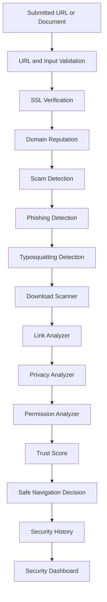

# Saralo Security Engine Design

## 1. Purpose

The Security Engine protects Saralo users, infrastructure, and AI systems when handling arbitrary URLs, fetched webpages, uploaded documents, generated outputs, and user interactions.

Security is a product feature, not just an infrastructure concern. Users should understand when a page is safe, suspicious, restricted, or blocked.

## 2. Security Architecture

## 3. Security Decisions

Possible outcomes:

- `allow`: Safe enough to fetch, transform, and display.
- `warn`: Show content with clear user warning.
- `restrict`: Show summary or safe preview, but disable risky links, forms, downloads, or actions.
- `block`: Do not fetch or display content.

Decision factors:

- URL validity.
- SSL status.
- Domain reputation.
- Redirect chain.
- Known malicious indicators.
- Sensitive forms.
- Downloads.
- Prompt injection attempts.
- User or tenant policy.

## 4. URL Validation

Validation rules:

- Allow only `http` and `https`.
- Prefer `https`.
- Reject `file`, `javascript`, `data`, `blob`, `ftp`, and custom schemes.
- Normalize punycode domains.
- Normalize trailing slashes and fragments.
- Reject embedded credentials in URLs.
- Reject malformed ports.
- Reject private IP targets.
- Reject localhost targets.
- Re-resolve DNS after every redirect.
- Enforce maximum redirect count.

Blocked targets:

- `127.0.0.0/8`
- `10.0.0.0/8`
- `172.16.0.0/12`
- `192.168.0.0/16`
- `169.254.0.0/16`
- `::1`
- private IPv6 ranges
- cloud metadata service IPs

## 5. SSL Verification

Checks:

- Valid certificate chain.
- Certificate hostname matches domain.
- Certificate not expired.
- Certificate not self-signed unless enterprise policy allows.
- Modern TLS support.
- No downgrade to insecure protocol.
- Mixed content detection after fetch.

Outcomes:

- Valid HTTPS improves trust score.
- Expired or mismatched certificate triggers `warn` or `block`.
- HTTP-only sites trigger at least a visible warning.

## 6. Domain Reputation

Signals:

- Known malicious domain feeds.
- Safe browsing provider.
- Internal blocklist.
- Enterprise allowlist or denylist.
- Domain age.
- Suspicious TLD patterns.
- Recent reputation changes.
- Prior Saralo security history.

Reputation cache:

- Stored in `domain_reputation_cache`.
- Short TTL for suspicious domains.
- Longer TTL for high-confidence safe domains.

## 7. Scam Detection

Scam indicators:

- Urgent payment language.
- Gift card or wire transfer requests.
- Fake support language.
- Account suspension pressure.
- Unrealistic rewards.
- Impersonation of government, bank, healthcare, or delivery services.
- Hidden fees.
- Mismatched brand names.

AI may assist scam detection, but deterministic rules and reputation checks must remain primary for high-risk decisions.

## 8. Phishing Detection

Signals:

- Login forms on suspicious domains.
- Password fields on non-HTTPS pages.
- Brand impersonation.
- Mismatched visible text and link targets.
- Suspicious redirects.
- Homograph domains.
- Forms requesting credentials, payment information, IDs, or health data.
- Hidden iframes or obfuscated scripts in raw content.

Actions:

- Warn before displaying login or payment forms.
- Restrict interaction with suspicious forms.
- Block high-confidence phishing pages.

## 9. Typosquatting Detection

Checks:

- Edit distance against high-value domains.
- Homoglyph detection.
- Punycode inspection.
- Extra hyphen or character insertion.
- Common transposition patterns.
- Suspicious subdomain abuse.

Examples:

- `paypa1.example`
- `g00gle.example`
- `support-bank-login.example`

Outcome:

- Typosquatting indicators reduce trust score and create a user-visible warning.

## 10. Download Scanner

Downloads are high-risk and should be restricted by default.

Checks:

- File extension.
- MIME type.
- Content disposition.
- File size.
- Archive nesting.
- Known malware indicators.
- Executable or script file detection.
- Reputation lookup.

Rules:

- Executable downloads are blocked in MVP.
- Unknown file downloads are restricted.
- Documents may be scanned and converted into safe extracted text.
- Users must confirm before opening any source download link.

## 11. Link Analyzer

The Link Analyzer reviews links extracted from the page.

Checks:

- External vs same-domain links.
- Mismatched anchor text.
- Suspicious shorteners.
- Tracking links.
- Redirecting links.
- Download links.
- Login, payment, and form links.

Output:

- Link risk label.
- Destination domain.
- User-facing explanation.
- Safe navigation recommendation.

## 12. Privacy Analyzer

The Privacy Analyzer detects data collection and privacy-sensitive requests.

Signals:

- Forms requesting name, address, email, phone, ID numbers, health details, payment details, or passwords.
- Third-party trackers.
- Cookie banners.
- Consent language.
- Hidden fields.
- Unclear data usage statements.

Output:

- Sensitive fields list.
- Plain-language privacy warning.
- Consent guidance.
- Data minimization hints.

## 13. Permission Analyzer

Checks page requests or instructions related to:

- Location.
- Camera.
- Microphone.
- Notifications.
- Clipboard.
- File uploads.
- Payment.
- Browser extension permissions.

Rules:

- Saralo should explain permission requests before users grant them.
- The Chrome extension must request minimal permissions.
- Permission warnings must be plain language.

## 14. Safe Navigation

Safe Navigation controls how users move from Saralo to source content.

Rules:

- Show destination domain before opening external links.
- Warn before leaving Saralo for risky links.
- Require confirmation for payment, login, download, and sensitive form actions.
- Disable links when decision is `restrict` or `block`.
- Preserve access to source URL when safe.
- Never auto-submit forms.

## 15. Trust Score

Trust score is an integer from 0 to 100.

Suggested scoring:

- HTTPS valid: +15.
- Known good reputation: +20.
- No suspicious redirects: +10.
- No sensitive forms: +10.
- No scam language: +10.
- Clean link analysis: +10.
- Recognized domain age: +5.
- Safe content type: +5.
- No prompt injection: +5.
- Enterprise allowlist: +10.

Penalties:

- HTTP only: -15.
- Expired SSL: -25.
- Known bad reputation: -80.
- Phishing indicators: -50.
- Typosquatting indicators: -30.
- Sensitive forms: -20.
- Executable downloads: -40.
- Prompt injection: -20.
- Suspicious redirects: -25.

Score bands:

- `80-100`: allow.
- `60-79`: allow or warn.
- `40-59`: warn or restrict.
- `20-39`: restrict.
- `0-19`: block.

Policy can override score.

## 16. Security Dashboard

User dashboard:

- Recent security checks.
- Blocked pages.
- Warning history.
- Sensitive form warnings.
- Download warnings.
- Plain-language explanations.

Admin dashboard:

- Security decisions by day.
- Top blocked domains.
- Common risk categories.
- Prompt injection detections.
- SSRF blocks.
- Scanner errors.
- False positive feedback.

## 17. Security History

Stored in:

- `security_history`
- `security_findings`

User-visible fields:

- URL.
- Domain.
- Decision.
- Trust score.
- Plain-language reasons.
- Created time.

Internal fields:

- Scanner evidence.
- Raw signal scores.
- Provider response IDs.
- Redirect chain.
- DNS resolution path.
- Prompt injection evidence.

## 18. Security Events

- `UrlValidationStarted`
- `UrlValidationFailed`
- `SslVerificationCompleted`
- `DomainReputationChecked`
- `ScamSignalsDetected`
- `PhishingSignalsDetected`
- `TyposquattingChecked`
- `DownloadScanCompleted`
- `LinkAnalysisCompleted`
- `PrivacyAnalysisCompleted`
- `PermissionAnalysisCompleted`
- `TrustScoreCalculated`
- `SecurityDecisionMade`
- `SecurityHistoryRecorded`

## 19. Integration with AI

Security findings are passed to the AI Engine as trusted metadata.

Rules:

- AI cannot lower a security decision.
- AI can explain security warnings in plain language.
- Prompt injection detection runs before AI context assembly.
- Suspicious page text is labeled as untrusted.
- AI must not follow instructions embedded in fetched pages.

## 20. Integration with Accessibility

Security warnings must remain accessible:

- Plain language.
- Large touch targets.
- Icon and text labels.
- Screen reader labels.
- Voice-readable warnings.
- High contrast.
- Not color-only.

## 21. Hackathon MVP Scope

MVP security:

- URL validation.
- SSRF protection.
- HTTPS warning.
- Redirect limit.
- Basic domain reputation cache.
- Sensitive form detection.
- Link analyzer.
- Trust score.
- Security history.

Deferred:

- Full malware sandboxing.
- Advanced typosquatting model.
- Enterprise allowlists.
- Human review console.
- Browser extension permission analyzer.

## 22. Freeze Decisions

- All fetched content is untrusted.
- Security pipeline runs before AI.
- Private network targets are blocked.
- HTTP pages are warned.
- Sensitive form actions require confirmation.
- Downloads are restricted by default.
- Trust score is user-visible but policy-driven.
- Security history is stored for transparency.
- AI may explain but not override security decisions.

## 23. Review Hardening

- CTO: security is modeled as a reusable platform pipeline.
- Senior Backend Engineer: security outcomes are deterministic enough for services and workers to enforce.
- AI Engineer: AI receives trusted security metadata but cannot downgrade risk.
- Accessibility Engineer: warnings must be readable, voice-ready, and not color-only.
- Security Engineer: SSRF, phishing, scam, download, privacy, permission, and prompt risks are covered.
- UX Designer: trust score and safe navigation explain risk without overwhelming users.
- Product Manager: security history creates user trust and product differentiation.
- Hackathon Judge: visible safety checks make the demo feel credible, not just magical.
