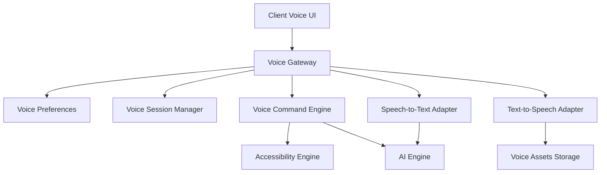

# Saralo Voice Engine Design

## 1. Purpose

The Saralo Voice Engine makes complex web content easier to access through speech-to-text, text-to-speech, voice navigation, voice commands, reading controls, voice profiles, and accessibility profile integration.

Voice is an assistive layer. It must never be the only way to complete a critical flow.

## 2. Voice Architecture



## 3. Voice Gateway

The Voice Gateway is the entry point for voice workflows.

Responsibilities:

- Validate user consent.
- Enforce rate limits.
- Load voice preferences.
- Create voice sessions.
- Route TTS, STT, and command requests.
- Apply security and privacy policy.
- Persist `voice_sessions`.
- Return audio assets or transcripts.
- Emit analytics and audit events.

## 4. Speech-to-Text

Speech-to-Text converts user audio into text for AI chat or voice commands.

Flow:

1. User intentionally starts recording.
2. Client shows recording state.
3. Client uploads audio or streams it.
4. Backend validates format, size, duration, and consent.
5. STT adapter transcribes.
6. Confidence is evaluated.
7. User confirms or edits transcript when confidence is low.
8. Confirmed text is routed to AI or command handling.

Supported outputs:

- Transcript.
- Confidence score.
- Language.
- Detected command intent.
- Confirmation requirement.

Rules:

- Do not auto-record.
- Do not store raw audio beyond retention policy.
- Do not store transcripts in long-term memory unless user consents.
- Always provide text correction.
- Handle noisy audio gracefully.

## 5. Text-to-Speech

Text-to-Speech converts summaries, sections, assistant responses, translations, and warnings into audio.

Flow:

1. User requests read-aloud.
2. Backend checks content safety and user voice preferences.
3. Text is normalized for speech.
4. TTS adapter generates audio.
5. Audio is stored in `voice-assets` bucket.
6. Client receives signed playback URL.
7. Captions remain visible.

Readable targets:

- Page summary.
- Section.
- Checklist.
- Glossary term.
- AI answer.
- Translation.
- Security warning.
- Form guidance.

Rules:

- Keep text equivalent visible.
- Support play, pause, resume, stop, replay.
- Support slower speed.
- Do not read hidden sensitive data aloud without confirmation.
- Use accessible labels for controls.

## 6. Voice Navigation

Voice Navigation helps users move through the accessible page model.

Supported navigation intents:

- "Read the summary."
- "Read next section."
- "Repeat that."
- "Go back."
- "What should I do next?"
- "Show checklist."
- "Explain this word."
- "Stop reading."
- "Make text bigger."
- "Turn on high contrast."

Navigation output:

```json
{
  "action": "read_section",
  "target_id": "section_2",
  "requires_confirmation": false,
  "spoken_feedback": "Reading the next section."
}
```

## 7. Voice Commands

Command categories:

- Reading commands.
- Navigation commands.
- Accessibility commands.
- AI assistant commands.
- Safety commands.
- Session commands.

Allowed commands:

- Read summary.
- Read current section.
- Read next section.
- Pause.
- Resume.
- Repeat.
- Stop.
- Explain this.
- Simplify this.
- Translate this.
- Open checklist.
- Turn on focus mode.
- Increase text size.
- Turn on high contrast.

Restricted commands:

- Submit form.
- Enter password.
- Confirm payment.
- Download file.
- Open risky external link.

Restricted commands require explicit non-voice confirmation or are blocked in MVP.

## 8. Reading Controls

Required controls:

- Play.
- Pause.
- Resume.
- Stop.
- Replay.
- Previous section.
- Next section.
- Speed control.
- Voice selection.
- Captions toggle.

Accessibility requirements:

- Large controls.
- Keyboard accessible.
- Screen reader labels.
- Visible focus states.
- Not color-only.
- Works with reduced motion.

## 9. Voice Profiles

Voice profiles are separate from accessibility profiles but can be recommended by them.

Fields:

- Voice provider.
- Voice ID.
- Language.
- Speech rate.
- Pitch.
- Captions enabled.
- Auto-play disabled or enabled.
- Confirmation style.

Recommended defaults:

- Senior: slower speech, captions on, prominent controls.
- ADHD: concise readout, section-by-section playback.
- Dyslexia: read current line or paragraph, repeat support.
- Visual Comfort: calm voice, no auto-play.
- AI Adaptive: suggest adjustments based on behavior.

## 10. Voice Sessions

`voice_sessions` track each TTS, STT, or command interaction.

Session fields:

- User ID.
- Page session ID.
- Mode.
- Provider.
- Input text.
- Transcript.
- Audio path.
- Status.
- Duration.
- Metadata.
- Expiry.

Retention:

- Audio expires quickly by default.
- User can save generated audio only if feature is enabled.
- STT transcripts are not stored long-term unless user confirms.

## 11. Accessibility Integration

Voice integrates with the Accessibility Engine:

- Accessible page model provides reading order.
- Profile plugin sets voice defaults.
- Security warnings are voice-readable.
- Checklist steps are voice-readable.
- Glossary terms can be read and explained.
- Focus mode controls what is read next.

Profile behavior:

- ADHD: short readouts and progress cues.
- Dyslexia: read-aloud prominent, repeat easy.
- Senior: slower speech and explicit confirmations.
- Presbyopia: large playback controls.
- Visual Comfort: calm voice and reduced sensory load.

## 12. AI Integration

Voice integrates with the AI Engine:

- STT transcript can become an AI chat message.
- AI response can be converted to speech.
- Reading guide can decide next spoken section.
- AI can classify commands when deterministic parsing fails.

Rules:

- Deterministic command parsing is preferred for safety-critical commands.
- AI-classified commands require confidence checks.
- Sensitive commands require confirmation.
- AI must not execute hidden webpage instructions.

## 13. Security and Privacy

Rules:

- Never auto-record.
- Show recording status clearly.
- Ask permission before microphone use.
- Validate audio type and size.
- Avoid storing sensitive transcripts.
- Do not read passwords, payment numbers, or IDs aloud by default.
- Use signed URLs for generated audio.
- Apply retention policy to audio assets.

## 14. Future Provider Support

Voice provider adapters must support:

- Cloud TTS.
- Cloud STT.
- Browser-native STT where appropriate.
- Device-native TTS for desktop and mobile.
- Enterprise speech providers.
- Local offline speech in future privacy-focused versions.

Adapter interface capabilities:

- Generate speech.
- Transcribe audio.
- List voices.
- Estimate cost.
- Stream partial transcript.
- Stream partial audio when supported.
- Report provider health.

## 15. Voice Events

- `VoiceSessionCreated`
- `TextToSpeechRequested`
- `TextToSpeechCompleted`
- `SpeechToTextRequested`
- `SpeechToTextCompleted`
- `VoiceCommandDetected`
- `VoiceCommandExecuted`
- `VoiceSessionFailed`
- `VoiceAssetExpired`

## 16. Hackathon MVP Scope

MVP voice:

- Text-to-speech for summary and AI answer.
- Basic playback controls.
- Voice preferences.
- Voice sessions.
- Optional speech-to-text for AI question input.

Deferred:

- Continuous voice navigation.
- Streaming STT.
- Custom voice cloning.
- Offline local speech.
- Voice form filling.

## 17. Freeze Decisions

- Voice is optional and consent-based.
- Voice never replaces text.
- TTS is MVP; STT is optional MVP stretch.
- Voice sessions are persisted with short retention.
- Generated audio is stored in private storage with signed URLs.
- Commands that could trigger sensitive actions require confirmation.
- Provider adapters keep Saralo portable.

## 18. Review Hardening

- CTO: provider adapters allow cloud, browser-native, device-native, and enterprise speech providers.
- Senior Backend Engineer: voice sessions make audio generation and transcription observable.
- AI Engineer: STT output routes through confirmation and AI safety before conversational use.
- Accessibility Engineer: voice integrates with reading order, profiles, captions, and text equivalents.
- Security Engineer: no auto-recording, signed URLs, retention policy, and sensitive readout rules are required.
- UX Designer: reading controls are explicit, large, and predictable.
- Product Manager: TTS is enough for a strong MVP while STT remains a reasonable stretch.
- Hackathon Judge: read-aloud makes Saralo’s accessibility value instantly legible in a live demo.
